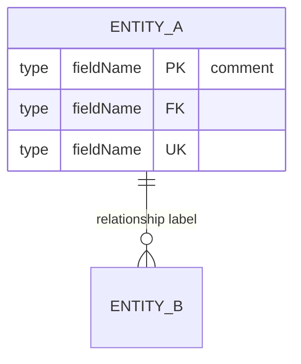

# ORM & Data Model Detection Patterns

## Glob Patterns for Entity/Model Files

### Java — JPA / Hibernate
```
**/model/**/*.java
**/entity/**/*.java
**/entities/**/*.java
**/domain/**/*.java
**/persistence/**/*.java
```

### ASP.NET Core — EF Core
```
**/Models/**/*.cs
**/Entities/**/*.cs
**/Domain/**/*.cs
**/Data/**/*.cs
**/*DbContext*.cs
**/*Context.cs
**/EntityConfigurations/**/*.cs
```

### Node.js — Sequelize
```
**/models/**/*.{js,ts}
**/entities/**/*.{js,ts}
```

### Node.js — TypeORM
```
**/entity/**/*.{js,ts}
**/entities/**/*.{js,ts}
```

### Node.js — Prisma
```
**/prisma/schema.prisma
```

### Node.js — Mongoose
```
**/models/**/*.{js,ts}
**/schemas/**/*.{js,ts}
```

### Python — SQLAlchemy
```
**/models/**/*.py
**/model/**/*.py
**/entities/**/*.py
```

### Python — Django
```
**/models.py
**/models/**/*.py
```

---

## Grep Patterns for Entity Detection

### JPA / Hibernate
```regex
@Entity
@Table\s*\(
@MappedSuperclass
@Embeddable
@Column\s*\(
@Id
@GeneratedValue
@OneToMany
@ManyToOne
@ManyToMany
@OneToOne
@JoinColumn
@JoinTable
```

### EF Core
```regex
DbSet<
\[Key\]
\[Required\]
\[MaxLength\s*\(
\[ForeignKey\s*\(
\[Table\s*\(
HasOne\s*\(
HasMany\s*\(
WithMany\s*\(
HasForeignKey\s*\(
OnModelCreating
IEntityTypeConfiguration
```

### Sequelize
```regex
sequelize\.define\s*\(
Model\.init\s*\(
DataTypes\.(STRING|INTEGER|BOOLEAN|DATE|FLOAT|DECIMAL|TEXT|UUID|ENUM)
belongsTo\s*\(
hasMany\s*\(
belongsToMany\s*\(
hasOne\s*\(
```

### TypeORM
```regex
@Entity\s*\(
@Column\s*\(
@PrimaryGeneratedColumn
@OneToMany\s*\(
@ManyToOne\s*\(
@ManyToMany\s*\(
@JoinTable\s*\(
@JoinColumn\s*\(
```

### Prisma
```regex
^model\s+\w+\s*\{
@id
@relation
@unique
@default
@map
```

### Mongoose
```regex
new\s+Schema\s*\(
mongoose\.model\s*\(
ref:\s*['"]
ObjectId
```

### SQLAlchemy
```regex
class\s+\w+\(.*Base\)
class\s+\w+\(.*db\.Model\)
Column\s*\(
relationship\s*\(
ForeignKey\s*\(
```

### Django ORM
```regex
class\s+\w+\(models\.Model\)
models\.(CharField|IntegerField|ForeignKey|ManyToManyField|OneToOneField|BooleanField|DateTimeField|TextField|DecimalField)
```

---

## Migration File Patterns

| Tool | Glob Pattern | Version Format |
|------|-------------|----------------|
| Flyway | `**/db/migration/V*__*.sql` | `V1__description.sql` |
| Liquibase | `**/db/changelog/*.{xml,yaml,yml,sql}` | Numbered or dated |
| EF Core | `**/Migrations/*.cs` | Timestamped class names |
| Alembic | `**/alembic/versions/*.py` | Hash-prefixed |
| Sequelize CLI | `**/migrations/*.{js,ts}` | Timestamped |
| Prisma Migrate | `**/prisma/migrations/*/migration.sql` | Timestamped directories |
| Django | `**/migrations/0*.py` | `0001_initial.py` |

---

## Relationship Type Mapping

| ORM Concept | Relationship Type | FK Location |
|------------|-------------------|-------------|
| `@OneToMany` / `hasMany` | ONE_TO_MANY | FK on child table |
| `@ManyToOne` / `belongsTo` | MANY_TO_ONE | FK on this table |
| `@OneToOne` / `hasOne` | ONE_TO_ONE | FK on either table |
| `@ManyToMany` / `belongsToMany` | MANY_TO_MANY | Join table |

---

## Mermaid ER Diagram Syntax Reference



### Cardinality Notation
| Symbol | Meaning |
|--------|---------|
| `\|\|` | Exactly one |
| `o\|` | Zero or one |
| `}o` | Zero or more |
| `}\|` | One or more |
| `\|{` | One or more (reverse) |
| `o{` | Zero or more (reverse) |

### Field Markers
| Marker | Meaning |
|--------|---------|
| `PK` | Primary Key |
| `FK` | Foreign Key |
| `UK` | Unique Key |

---

## Data Pattern Detection

### Soft Delete Indicators
```regex
deletedAt|deleted_at|isDeleted|is_deleted|IsActive|is_active|SoftDelete|@SQLDelete|@Where.*deleted
```

### Audit Field Indicators
```regex
createdAt|created_at|CreatedAt|updatedAt|updated_at|UpdatedAt|createdBy|created_by|CreatedBy|modifiedBy|modified_by|ModifiedBy|@CreatedDate|@LastModifiedDate|@CreatedBy|@LastModifiedBy
```

### Enum Detection
```regex
@Enumerated
enum\s+\w+\s*\{
DataTypes\.ENUM
```
