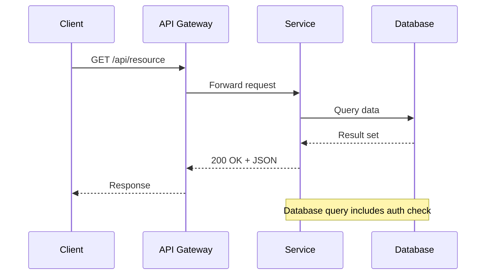
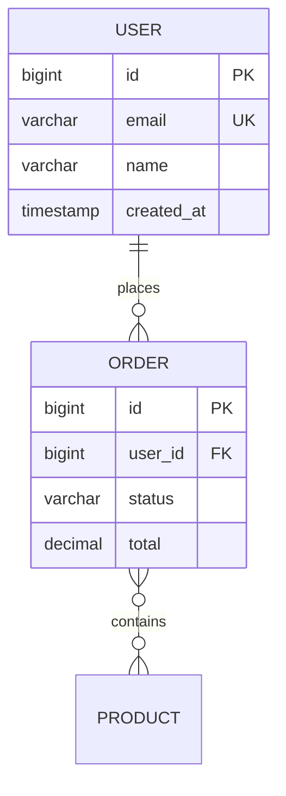
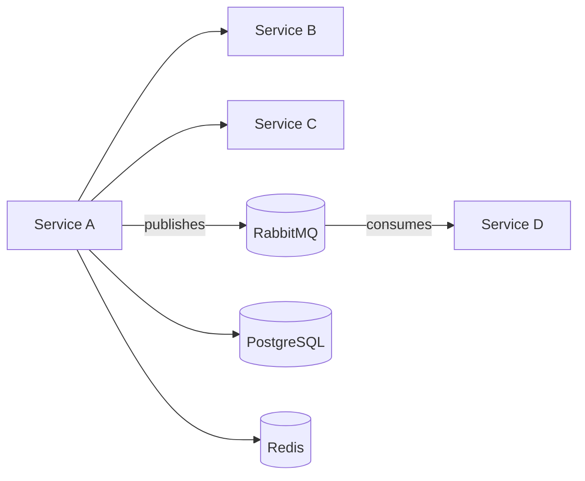

# Mermaid Diagram Syntax Reference

## Sequence Diagrams



### Arrow Types
| Syntax | Meaning |
|--------|---------|
| `->>` | Solid line with arrowhead (sync call) |
| `-->>` | Dotted line with arrowhead (response) |
| `--)` | Solid line with open arrow (async/fire-and-forget) |
| `--)` | Dotted line with open arrow (async response) |

### Constructs
```
alt condition
    A->>B: action
else other condition
    A->>C: action
end

loop Every 5 seconds
    A->>B: poll
end

opt Optional step
    A->>B: action
end

Note over A,B: Description
Note right of A: Side note
```

---

## ER Diagrams



### Cardinality
| Left | Right | Meaning |
|------|-------|---------|
| `\|\|` | `\|\|` | Exactly one to exactly one |
| `\|\|` | `o{` | Exactly one to zero or more |
| `\|\|` | `\|{` | Exactly one to one or more |
| `o\|` | `o{` | Zero or one to zero or more |

### Field Markers
- `PK` — Primary Key
- `FK` — Foreign Key
- `UK` — Unique Key

---

## Flowcharts / Graphs



### Direction
| Code | Direction |
|------|-----------|
| `graph TB` | Top to bottom |
| `graph LR` | Left to right |
| `graph BT` | Bottom to top |
| `graph RL` | Right to left |

### Node Shapes
| Syntax | Shape |
|--------|-------|
| `A[text]` | Rectangle |
| `A(text)` | Rounded rectangle |
| `A{text}` | Diamond (decision) |
| `A[(text)]` | Cylinder (database) |
| `A([text])` | Stadium (rounded) |
| `A[[text]]` | Subroutine |
| `A>text]` | Asymmetric |

### Edge Labels
```
A -->|label text| B
A -- label text --> B
```

### Styling
```
style A fill:#f9f,stroke:#333
classDef highlight fill:#ff9,stroke:#333
class A,B highlight
```

---

## Architecture Documentation Patterns

### Service Overview Template
```markdown
## Architecture Overview

### System Context
[Mermaid graph showing this service in context of the broader system]

### Internal Structure
[Mermaid graph showing modules/components within this service]

### Data Flow
[Mermaid sequence diagram showing primary data flows]
```

### API Documentation Endpoint Table Pattern
```markdown
| Method | Path | Auth | Description |
|--------|------|------|-------------|
| GET | /api/users | Bearer | List all users |
| POST | /api/users | Bearer + ADMIN | Create user |
| GET | /api/users/{id} | Bearer | Get user by ID |
```

### Data Model Documentation Pattern
```markdown
## Entity: User

| Field | Type | Nullable | Constraints | Notes |
|-------|------|----------|-------------|-------|
| id | BIGINT | No | PK, Auto-generated | |
| email | VARCHAR(255) | No | Unique | Validated: @Email |
| name | VARCHAR(100) | No | | |
| created_at | TIMESTAMP | No | | Audit field |

### Relationships
- **Orders**: One-to-many (User has many Orders)
```
