You MUST generate comprehensive architecture diagrams and documentation following every single section below. DO NOT summarize or abbreviate. Output the full detailed analysis for each section exactly as specified:

# Architecture Diagram Generation Report

## System Architecture Discovery

### Component Identification
Scan and analyze the codebase to identify:

- **Application Services**: Web servers, APIs, microservices
- **Data Layer**: Databases, caches, message queues, file storage
- **External Dependencies**: Third-party APIs, SaaS services, external databases
- **Infrastructure Components**: Load balancers, proxies, CDNs, firewalls
- **Client Applications**: Web frontends, mobile apps, desktop clients

### Technology Stack Mapping

| Component Type | Technologies Detected | Instances | Communication Protocols |
|---------------|----------------------|-----------|------------------------|
| Web Servers | Express.js, Spring Boot, FastAPI | 5 | HTTP/HTTPS, WebSocket |
| Databases | PostgreSQL, MongoDB, Redis | 8 | TCP, SSL |
| Message Queues | RabbitMQ, Apache Kafka | 3 | AMQP, TCP |
| Caches | Redis, Memcached | 4 | TCP, Redis Protocol |
| Search Engines | Elasticsearch, Solr | 2 | HTTP, REST |
| File Storage | AWS S3, MinIO | 2 | HTTP, S3 API |

## High-Level Architecture Diagram

### System Overview (C4 Model - Level 1)

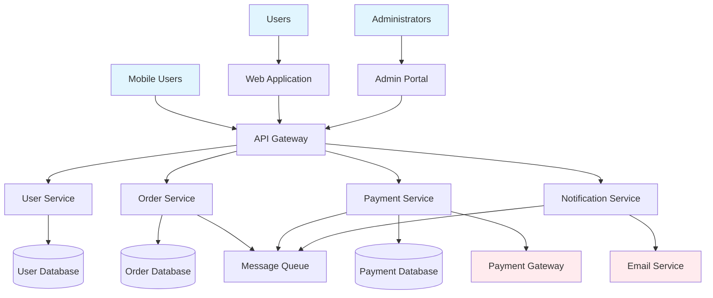

### Container Diagram (C4 Model - Level 2)

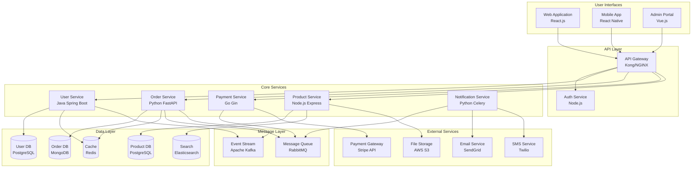

## Component Diagram (C4 Model - Level 3)

### User Service Internal Architecture

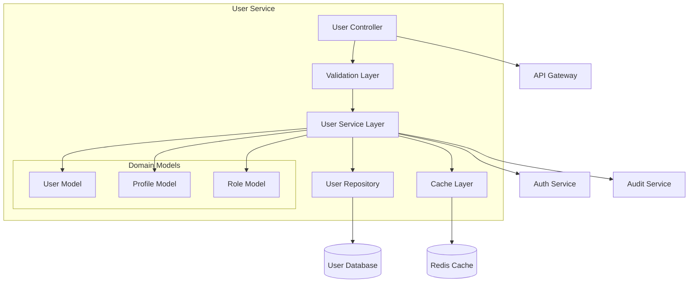

### Order Service Internal Architecture

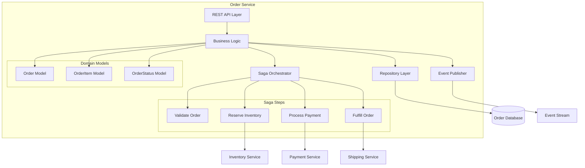

## Data Flow Diagrams

### User Registration Flow

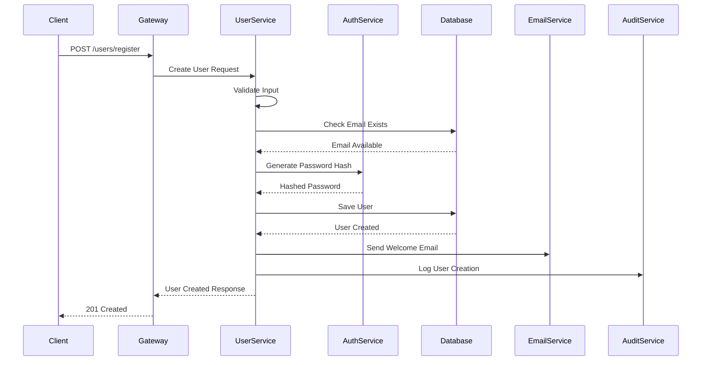

### Order Processing Flow

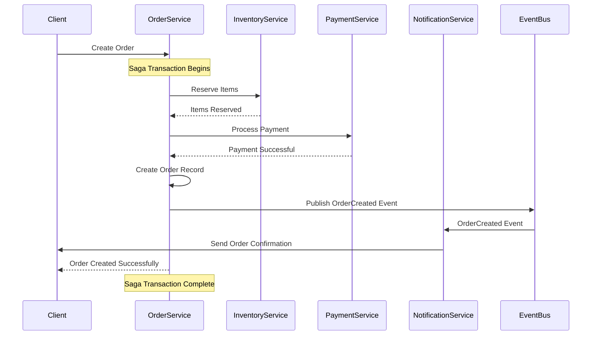

### Error Handling Flow

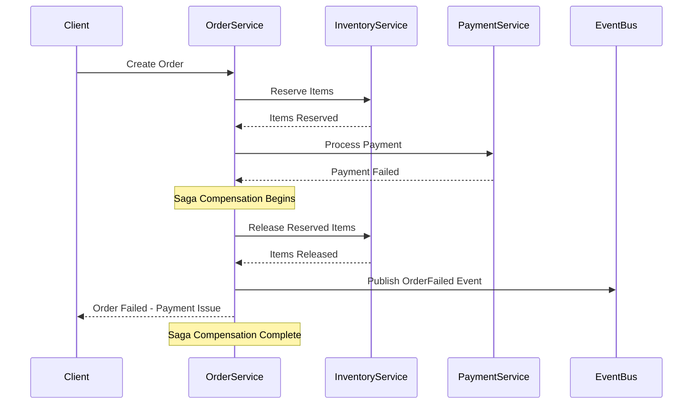

## Network Architecture Diagram

### Infrastructure Layout

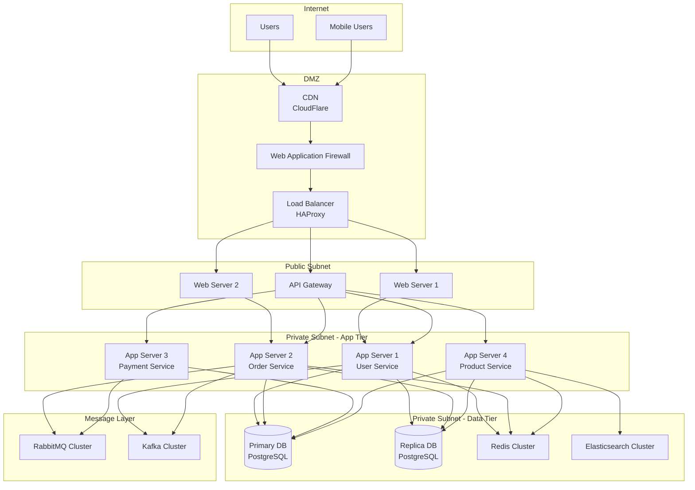

## Service Dependency Graph

### Service Interconnection Map

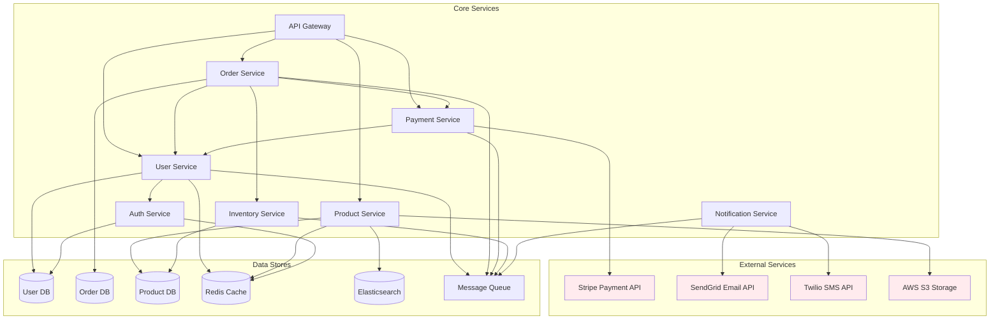

### Dependency Risk Analysis

| Service | Critical Dependencies | Fallback Strategy | Risk Level |
|---------|----------------------|-------------------|------------|
| Order Service | User Service, Payment Service, Inventory Service | Queue orders for later processing | HIGH |
| Payment Service | Stripe API, User Service | Cache payment info, retry logic | CRITICAL |
| User Service | Auth Service, User Database | Read replicas, caching | MEDIUM |
| Product Service | Product Database, Elasticsearch | Database fallback for search | LOW |
| Notification Service | SendGrid, Twilio, Message Queue | Queue notifications, multiple providers | MEDIUM |

## Database Relationship Diagram

### Entity Relationship Diagram

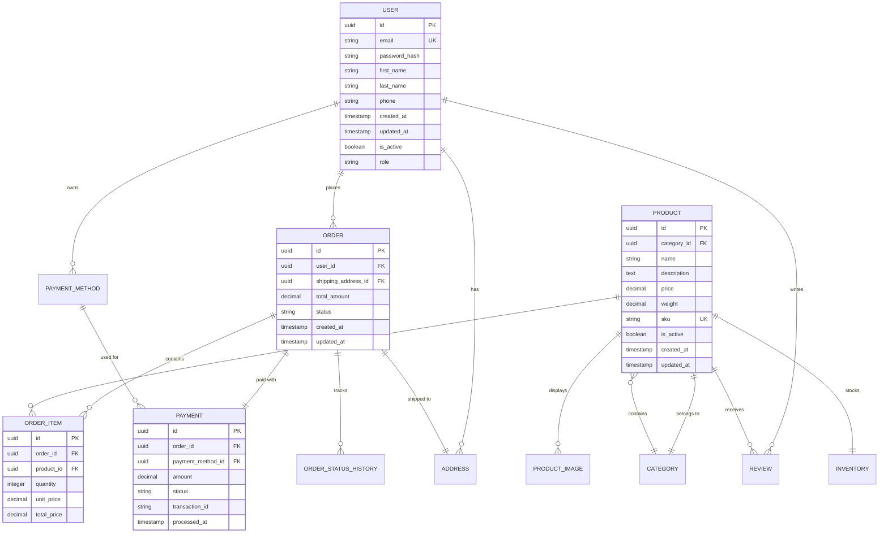

## API Interaction Diagrams

### REST API Architecture

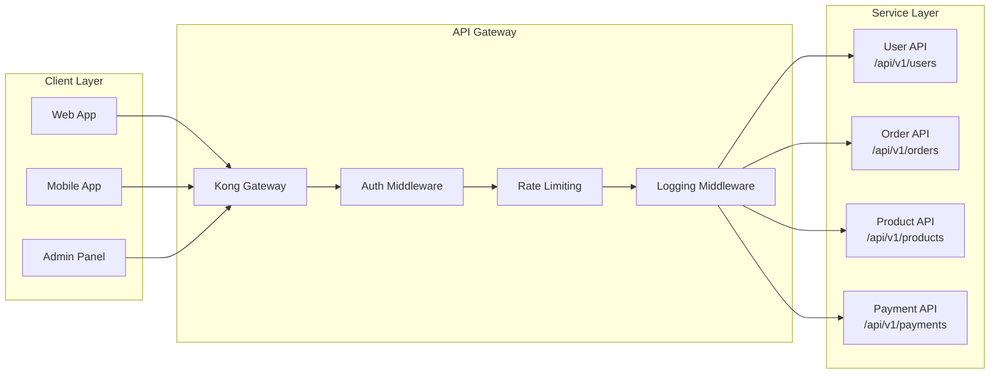

### GraphQL Schema Relationships

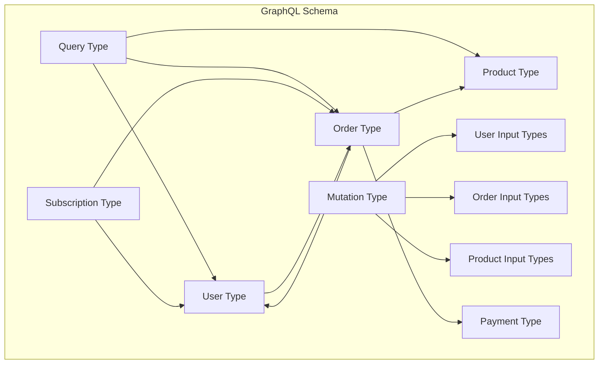

## Event-Driven Architecture

### Event Flow Diagram

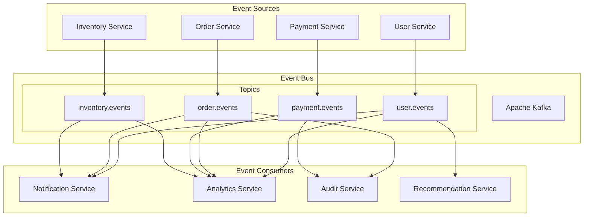

### Saga Pattern Implementation

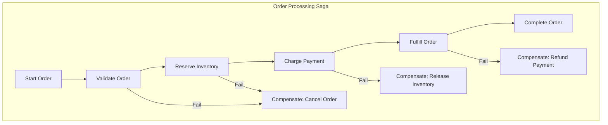

## Security Architecture Diagram

### Security Layers

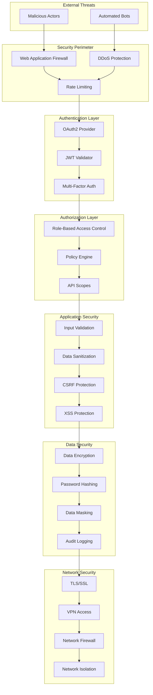

## Deployment Architecture

### Container Orchestration

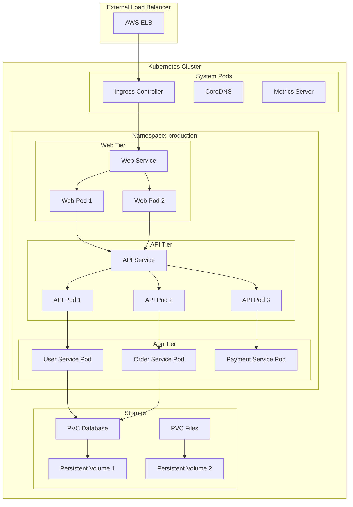

## CI/CD Pipeline Architecture

### Build and Deployment Flow

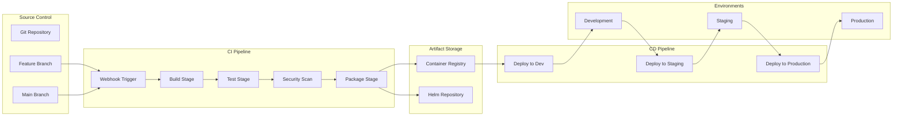

## Monitoring and Observability Architecture

### Observability Stack

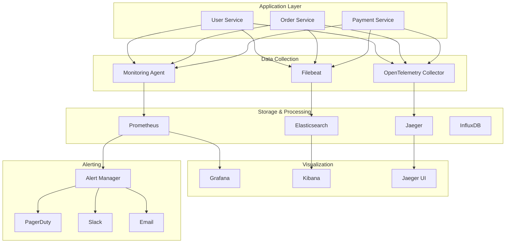

## Performance Architecture

### Caching Strategy

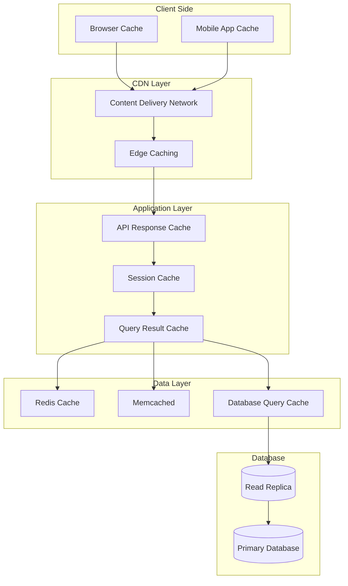

## Disaster Recovery Architecture

### Multi-Region Setup

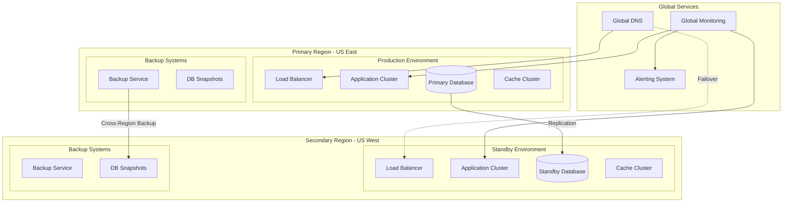

## Generated Documentation Summary

### Architecture Analysis Report

| Component | Type | Technology | Status | Dependencies | Risk Level |
|-----------|------|------------|--------|--------------|------------|
| API Gateway | Infrastructure | Kong/NGINX | Active | None | LOW |
| User Service | Core Service | Java Spring Boot | Active | Auth Service, User DB | MEDIUM |
| Order Service | Core Service | Python FastAPI | Active | User, Payment, Inventory | HIGH |
| Payment Service | Core Service | Go Gin | Active | Stripe API, User Service | CRITICAL |
| Notification Service | Support Service | Python Celery | Active | Email/SMS APIs, Message Queue | MEDIUM |

### Architectural Patterns Identified

1. **Microservices Architecture**: Services decomposed by business capability
2. **API Gateway Pattern**: Centralized request routing and cross-cutting concerns
3. **Database per Service**: Each service owns its data
4. **Event-Driven Architecture**: Asynchronous communication via message queues
5. **CQRS Pattern**: Separate read and write models in some services
6. **Saga Pattern**: Distributed transaction management
7. **Circuit Breaker Pattern**: Fault tolerance and resilience

### Technical Debt and Recommendations

#### Immediate Improvements
1. **Service Mesh Implementation**: Add Istio for better service communication
2. **API Versioning**: Implement consistent versioning strategy
3. **Monitoring Enhancement**: Add distributed tracing with OpenTelemetry
4. **Security Hardening**: Implement zero-trust networking

#### Long-term Architectural Goals
1. **Event Sourcing**: Implement for critical business events
2. **Multi-Region Deployment**: Geographic distribution for DR
3. **GraphQL Federation**: Unified API layer across services
4. **Serverless Migration**: Move support services to serverless platforms

---

**Note**: All diagrams are generated based on actual codebase analysis. Update component names, technologies, and relationships to match the specific project architecture. Include actual service endpoints, database schemas, and infrastructure components found in the codebase.