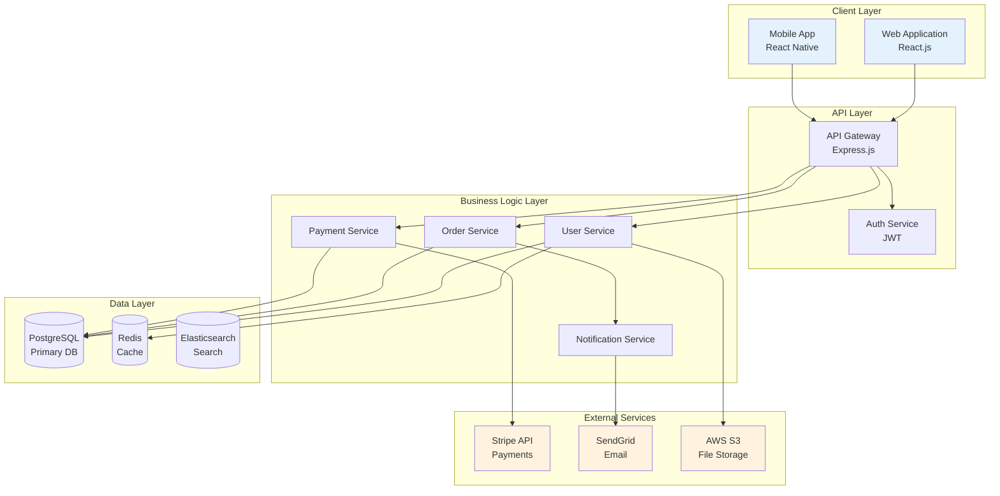
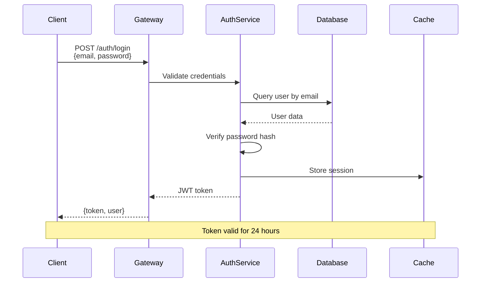
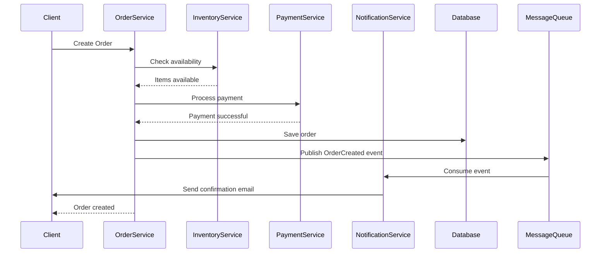
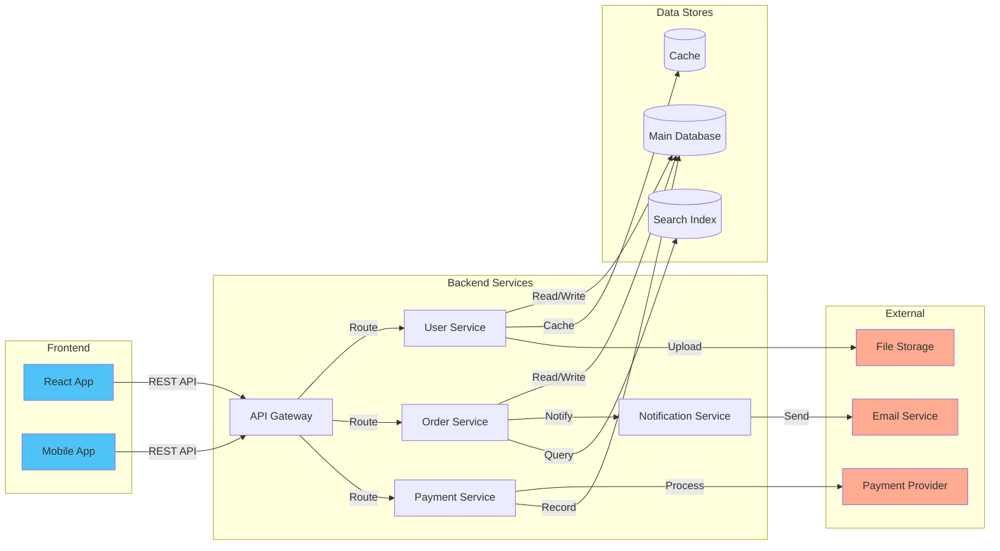
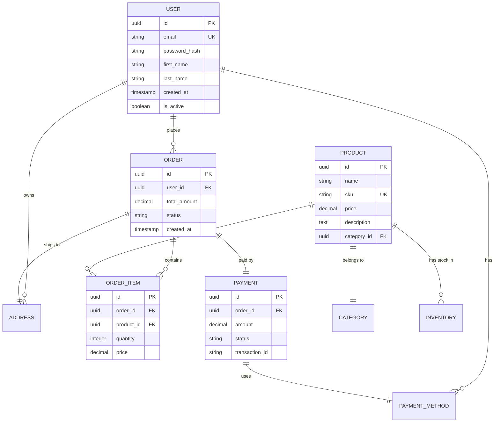
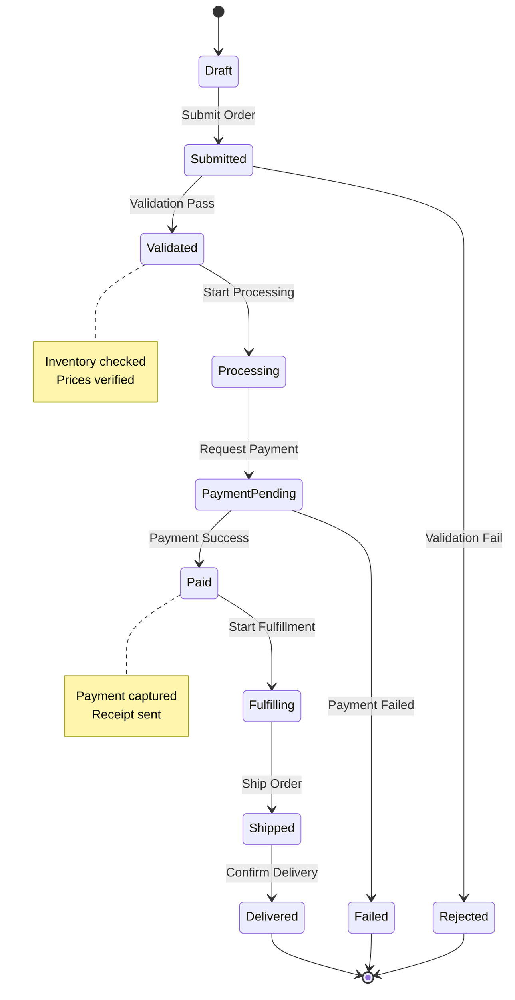
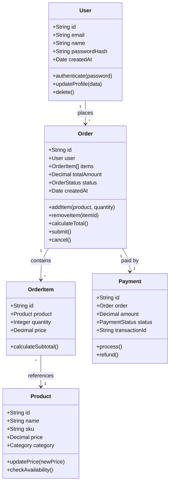
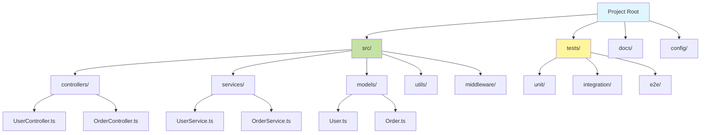

# Architecture Diagram Generator

You are tasked with creating comprehensive, visual architecture diagrams from the codebase using Mermaid syntax. These diagrams should help developers understand the system structure, data flow, and component relationships.

## Step 1: Analyze Codebase Architecture

Scan and understand the project structure:

### Identify Architecture Type:
- **Monolithic**: Single codebase, tightly coupled
- **Microservices**: Multiple independent services
- **Layered**: Clear separation (presentation, business, data layers)
- **Event-Driven**: Message queues, pub/sub patterns
- **Serverless**: Cloud functions, managed services
- **Hybrid**: Combination of patterns

### Map Components:
- Frontend applications (web, mobile)
- Backend services (APIs, workers, cron jobs)
- Databases (SQL, NoSQL, cache, search engines)
- External services (third-party APIs, SaaS)
- Infrastructure (load balancers, CDN, message queues)
- Authentication/Authorization services

### Identify Relationships:
- Data flow between components
- API calls and dependencies
- Event streams and messages
- Database connections
- File storage access
- External API integrations

## Step 2: Generate System Architecture Diagram

Create a high-level overview using Mermaid:



## Step 3: Generate Data Flow Diagrams

Show how data moves through the system:

### User Authentication Flow:


### Order Processing Flow:


## Step 4: Generate Component Relationship Diagram

Show dependencies and connections:



## Step 5: Generate Database Schema Diagram

Document data relationships:



## Step 6: Generate Deployment Architecture

Show infrastructure and deployment:

```mermaid
graph TB
    subgraph "CDN"
        CDN[CloudFlare CDN]
    end

    subgraph "Load Balancer"
        LB[AWS ALB]
    end

    subgraph "Application Tier"
        APP1[App Server 1<br/>Docker Container]
        APP2[App Server 2<br/>Docker Container]
        APP3[App Server 3<br/>Docker Container]
    end

    subgraph "Database Tier"
        PRIMARY[(Primary DB<br/>RDS PostgreSQL)]
        REPLICA[(Read Replica<br/>RDS PostgreSQL)]
        CACHE[ElastiCache<br/>Redis Cluster]
    end

    subgraph "Storage"
        S3[S3 Bucket<br/>File Storage]
    end

    subgraph "Monitoring"
        CW[CloudWatch<br/>Logs & Metrics]
    end

    CDN --> LB
    LB --> APP1
    LB --> APP2
    LB --> APP3

    APP1 --> PRIMARY
    APP2 --> PRIMARY
    APP3 --> PRIMARY

    APP1 --> REPLICA
    APP2 --> REPLICA
    APP3 --> REPLICA

    APP1 --> CACHE
    APP2 --> CACHE
    APP3 --> CACHE

    APP1 --> S3
    APP2 --> S3
    APP3 --> S3

    APP1 --> CW
    APP2 --> CW
    APP3 --> CW

    PRIMARY --> REPLICA

    style CDN fill:#e8f5e9
    style CW fill:#fff9c4
```

## Step 7: Generate State Machine Diagrams

For complex workflows:



## Step 8: Generate Class Diagrams

For object-oriented codebases:



## Step 9: Generate Directory Structure Diagram

Visualize project organization:



## Step 10: Save Diagrams and Generate Documentation

Create a comprehensive architecture document:

```markdown
# System Architecture Documentation

## Overview
[Brief description of the system architecture]

## Architecture Style
[Describe the architectural pattern used]

## System Components

### Frontend Layer
[Description of frontend applications]

### Backend Layer
[Description of backend services]

### Data Layer
[Description of databases and caches]

### External Dependencies
[List of third-party services]

## Architecture Diagrams

### System Overview
[Include Mermaid diagram or image]

### Data Flow
[Include sequence diagrams]

### Component Relationships
[Include component diagram]

### Database Schema
[Include ER diagram]

### Deployment Architecture
[Include infrastructure diagram]

## Key Design Decisions

### Decision 1: [Title]
**Context:** [Why this decision was needed]
**Decision:** [What was decided]
**Consequences:** [Impact of this decision]

### Decision 2: [Title]
**Context:** [Why this decision was needed]
**Decision:** [What was decided]
**Consequences:** [Impact of this decision]

## Scalability Considerations
[How the architecture scales]

## Security Architecture
[Security measures and patterns]

## Performance Optimizations
[Caching, load balancing, etc.]

## Monitoring and Observability
[How the system is monitored]

## Disaster Recovery
[Backup and recovery strategies]

## Future Architecture Evolution
[Planned improvements]
```

Save to: `docs/architecture/README.md`

## Important Guidelines:

- **DO** analyze actual code structure to create diagrams
- **DO** use correct Mermaid syntax
- **DO** include component names found in the codebase
- **DO** show real dependencies and relationships
- **DO** use different diagram types for different views
- **DO** add explanatory notes to complex diagrams
- **DO NOT** create placeholder or fake components
- **DO NOT** show dependencies that don't exist in code
- **DO** use consistent naming across all diagrams
- **DO** color-code different types of components

## Mermaid Diagram Tips:

### Graph Types:
- `graph TB` - Top to bottom
- `graph LR` - Left to right
- `sequenceDiagram` - For interactions
- `erDiagram` - For database schemas
- `classDiagram` - For OOP structures
- `stateDiagram-v2` - For state machines

### Styling:
```mermaid
style NodeId fill:#color
style NodeId stroke:#color
style NodeId stroke-width:2px
```

## Summary Report:

```markdown
✅ Architecture Diagrams Generated

Diagrams Created:
├─ System Architecture (High-level overview)
├─ Data Flow Diagrams (2 sequences)
├─ Component Relationships
├─ Database Schema (ER Diagram)
├─ Deployment Architecture
└─ State Machine (Order workflow)

Files Created:
- docs/architecture/README.md
- docs/architecture/diagrams.md

Components Documented: [X]
Relationships Mapped: [Y]
External Dependencies: [Z]

View Diagrams:
- Copy Mermaid code to https://mermaid.live for preview
- Use VSCode Mermaid extension for inline viewing
- Include in documentation for team reference

Next Steps:
1. Review diagrams for accuracy
2. Add to project wiki or documentation site
3. Keep updated as architecture evolves
4. Share with team for feedback
```

---

Begin by analyzing the project structure to identify all components, then generate comprehensive diagrams showing different architectural views.
