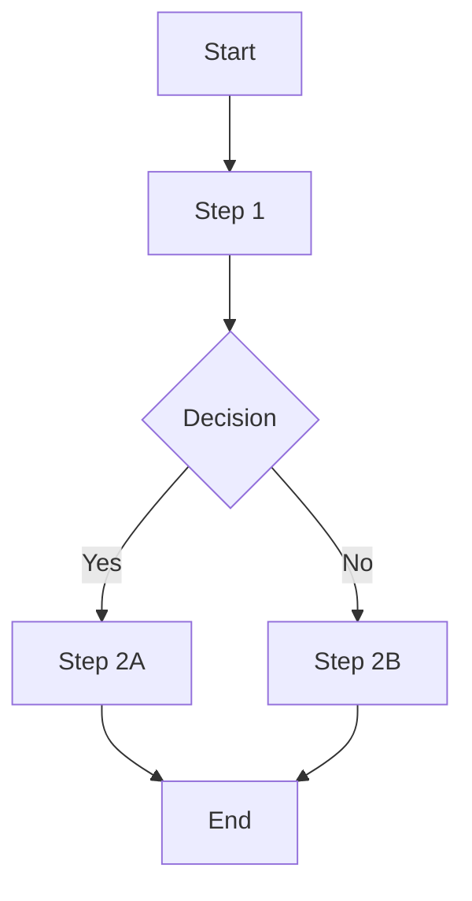

# Business Logic Mapping Command

You are tasked with extracting and understanding the business logic embedded in a legacy codebase. This command helps developers understand what the system does, why it does it, and how different business rules interact.

## Objective

Create a comprehensive map of all business logic, rules, validations, calculations, and workflows in the codebase, explaining them in plain business language.

## Step 1: Codebase Discovery

### Initial Scan
- Identify the project structure and entry points
- Detect the technology stack, framework, and architecture pattern
- Find configuration files that reveal business domains (routes, models, schemas)
- Locate key directories: controllers, services, models, handlers, business logic layers

### Key Files to Prioritize
- API endpoints and route definitions
- Service layer implementations
- Business rule engines
- Validation logic
- Calculation and formula implementations
- State machines and workflow engines
- Database models and schema definitions

## Step 2: Business Domain Identification

Analyze the codebase to identify distinct business domains:

### Domain Discovery
- **Entities**: What core business objects exist? (Users, Orders, Payments, Inventory, etc.)
- **Relationships**: How do entities relate to each other?
- **Bounded Contexts**: What are the logical divisions of business functionality?
- **Modules/Features**: What capabilities does the system provide?

### Output Format
```markdown
## Business Domains Identified

### Domain: [Name]
**Purpose**: [What business problem this domain solves]
**Key Entities**: [List of main entities]
**Core Responsibilities**: [What this domain handles]
**Files/Directories**: [Where this logic lives]
```

## Step 3: Business Rules Extraction

Extract all business rules, constraints, and validations:

### Types of Rules to Identify

**1. Validation Rules**
- Input validation (format, length, type)
- Business constraints (age limits, quantity limits)
- Cross-field validations
- State validations (can only do X when in state Y)

**2. Calculation Rules**
- Pricing calculations
- Tax and fee computations
- Discount and promotion logic
- Aggregations and summaries
- Formula-based calculations

**3. Authorization Rules**
- Role-based permissions
- Ownership checks
- Feature flags and access controls
- Conditional access based on state or attributes

**4. State Transition Rules**
- Status workflows (Draft → Pending → Approved)
- Lifecycle management
- State validation rules
- Trigger actions on state changes

**5. Business Process Rules**
- Multi-step workflows
- Approval chains
- Notification triggers
- Scheduled jobs and cron logic
- Event-driven processes

### Output Format
```markdown
## Business Rules Catalog

### Rule Category: [Validation/Calculation/Authorization/etc.]

#### Rule: [Rule Name]
**Location**: `file_path:line_number`
**Business Purpose**: [What business need this serves]
**Implementation**: [Plain language explanation of how it works]
**Conditions**: [When this rule applies]
**Exceptions**: [Special cases or overrides]
**Dependencies**: [Other rules or data this depends on]

**Code Example**:
```language
[Relevant code snippet]
```

**Business Impact**: [What happens if this rule is violated or removed]
```

## Step 4: Hidden Logic Detection

Identify logic that is not immediately obvious:

### Common Hidden Logic Patterns

**1. Magic Numbers and Constants**
- Hardcoded values without clear business meaning
- Constants defined far from where they're used
- Configuration values that encode business rules

**2. Implicit Business Rules**
- Logic buried in conditional statements
- Rules enforced by database constraints
- Validation in frontend AND backend (identify discrepancies)
- Default values that have business significance

**3. Side Effects**
- Cascading updates
- Audit trail creation
- Notification triggers
- Cache invalidation rules
- External system synchronization

**4. Temporal Logic**
- Date-based calculations
- Time-zone handling
- Expiration and TTL rules
- Scheduled executions
- Historical data handling

**5. Edge Cases and Special Handling**
- Null/empty handling with business implications
- Error recovery logic
- Fallback mechanisms
- Grandfather clauses (old data treated differently)

### Output Format
```markdown
## Hidden Business Logic

### Type: [Magic Numbers/Implicit Rules/Side Effects/etc.]

#### Finding: [Description]
**Location**: `file_path:line_number`
**Discovery**: [How this was found]
**Business Meaning**: [What this actually represents in business terms]
**Risk**: [Why this being hidden is problematic]
**Recommendation**: [How to make this more explicit]
```

## Step 5: Workflow and Process Mapping

Map out end-to-end business processes:

### Process Identification
- User journeys and use cases
- Data flow through the system
- Integration points with external systems
- Batch processes and scheduled jobs
- Event-driven workflows

### Output Format
```markdown
## Business Workflows

### Workflow: [Name]
**Trigger**: [What initiates this workflow]
**Purpose**: [Business objective]
**Actors**: [Who/what is involved]

**Steps**:
1. [Step 1 description]
   - Location: `file_path:line_number`
   - Business action: [What happens in business terms]
   - Technical action: [What happens in code]

2. [Step 2 description]
   - Location: `file_path:line_number`
   - Business action: [What happens in business terms]
   - Technical action: [What happens in code]

**Decision Points**:
- [Condition]: Leads to [Outcome A] or [Outcome B]
  - Location: `file_path:line_number`

**Success Outcome**: [What successful completion looks like]
**Failure Scenarios**: [What can go wrong and how it's handled]
**External Dependencies**: [APIs, databases, services involved]

**Diagram**:

```

## Step 6: Data Transformation Logic

Identify how data is transformed as it flows through the system:

### Transformation Patterns
- Input normalization and sanitization
- Data enrichment (adding computed fields)
- Format conversions
- Aggregations and rollups
- Data denormalization for performance
- DTO/Entity mappings

### Output Format
```markdown
## Data Transformations

### Transformation: [Name]
**Input**: [Source data structure]
**Output**: [Result data structure]
**Location**: `file_path:line_number`
**Purpose**: [Why this transformation is needed]
**Business Rules Applied**: [Any validations or calculations]
**Data Loss**: [Any fields dropped or information lost]
```

## Step 7: Integration and External System Logic

Map connections to external systems:

### External Dependencies
- Third-party APIs (payment gateways, email services, etc.)
- Database connections
- Message queues and event buses
- File systems and cloud storage
- Authentication providers

### Output Format
```markdown
## External System Integrations

### Integration: [System Name]
**Purpose**: [What business capability this provides]
**Type**: [API/Database/Queue/etc.]
**Location**: `file_path:line_number`
**Data Exchange**: [What data is sent/received]
**Error Handling**: [How failures are managed]
**Business Impact**: [What happens if this integration fails]
**Retry Logic**: [How retries are handled]
**Fallback**: [Alternative behavior if unavailable]
```

## Step 8: Business Metrics and KPIs

Identify business metrics being tracked:

### Metrics to Find
- Analytics events
- Logging patterns that indicate business events
- Counters and gauges
- Revenue calculations
- Performance indicators
- Business-critical measurements

### Output Format
```markdown
## Business Metrics

### Metric: [Name]
**Location**: `file_path:line_number`
**Business Question**: [What business question this answers]
**Calculation**: [How the metric is computed]
**Frequency**: [When/how often this is tracked]
**Stakeholders**: [Who uses this metric]
```

## Step 9: Undocumented Business Rules

Flag business logic that lacks documentation:

### Red Flags
- Complex conditionals without comments
- Magic numbers
- Non-obvious state management
- Error codes without explanations
- Cryptic variable names encoding business meaning

### Output Format
```markdown
## Undocumented Business Logic (High Priority for Clarification)

### Location: `file_path:line_number`
**Code Complexity**: [High/Medium/Low]
**Business Impact**: [Critical/High/Medium/Low]
**Issue**: [What makes this difficult to understand]
**Inferred Purpose**: [Best guess at business purpose]
**Recommended Action**: [What documentation or refactoring is needed]
```

## Step 10: Business Logic Summary Report

Provide an executive summary:

```markdown
# Business Logic Map - Executive Summary

## System Overview
**Purpose**: [High-level description of what the system does]
**Primary Business Domains**: [List of 3-5 main domains]
**Technology Stack**: [Key technologies]

## Business Capabilities
[List of core business features the system provides]

## Key Business Rules Summary
**Total Rules Identified**: [count]
- Validation Rules: [count]
- Calculation Rules: [count]
- Authorization Rules: [count]
- Workflow Rules: [count]
- Integration Rules: [count]

## Critical Business Workflows
[Top 5 most important business processes]

## Business Logic Health Assessment

### Strengths
- [Positive findings about business logic clarity]

### Risks and Concerns
- [Business logic that is fragile, hidden, or poorly understood]
- [Areas with high complexity]
- [Missing documentation for critical paths]

### Knowledge Gaps
[Areas where business logic cannot be fully understood from code alone]

## Recommendations for Business Stakeholders
1. [High-priority items that need business clarification]
2. [Areas where business rules should be externalized]
3. [Opportunities to simplify business logic]
4. [Documentation priorities]

## Recommendations for Developers
1. [Refactoring opportunities]
2. [Areas to add documentation]
3. [Technical debt related to business logic]
```

## Special Instructions

### Language and Terminology
- Use business-friendly language, not technical jargon
- Explain WHY rules exist, not just WHAT they do
- Identify business terms and create a glossary if needed
- Highlight business assumptions embedded in code

### Thoroughness
- Scan ALL relevant files, not just main business logic
- Look for business rules in unexpected places (migrations, configs, tests)
- Check comments and documentation strings for business context
- Examine test cases for business scenarios

### Prioritization
Focus investigation effort on:
1. Revenue-impacting logic
2. Compliance and regulatory rules
3. User-facing workflows
4. Data integrity rules
5. Integration points
6. Security and authorization

### Code Patterns to Search For

**Conditionals with business meaning**:
- `if (status == "approved" && amount > 1000)`
- `switch (userRole)`
- `case "premium"`

**Calculations**:
- Mathematical operations
- Date arithmetic
- String formatting with business formats

**State management**:
- Status enums
- State machine implementations
- Lifecycle hooks

**Validations**:
- `validate`, `check`, `verify` functions
- Regex patterns
- Comparison operators with constants

**Authorization**:
- `canAccess`, `hasPermission`, `isAuthorized`
- Role checks
- Feature flag evaluations

## Deliverable

Provide a comprehensive, well-organized report that enables:
1. **New developers** to understand what the system does
2. **Product managers** to understand what business rules are implemented
3. **Business analysts** to identify gaps between requirements and implementation
4. **Architects** to identify refactoring opportunities
5. **Auditors** to verify compliance rules

The report should be clear enough that someone with NO context about the system can understand its business purpose and core logic.

---

**Begin your analysis by identifying the codebase structure and proceed systematically through each step.**
