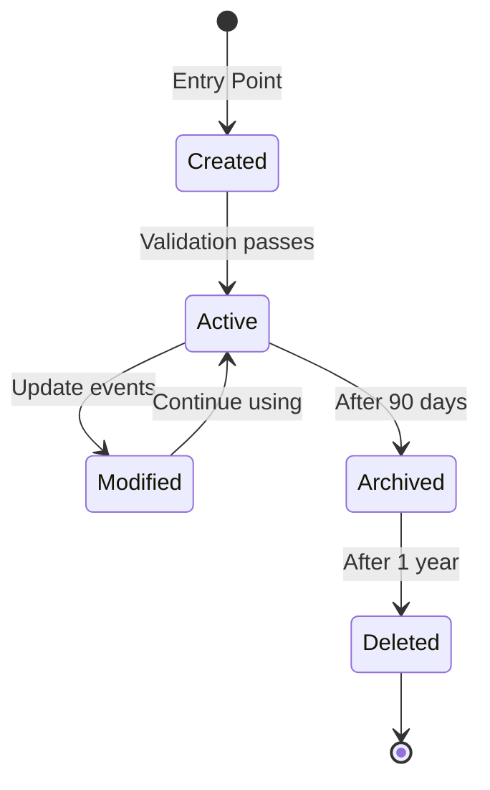
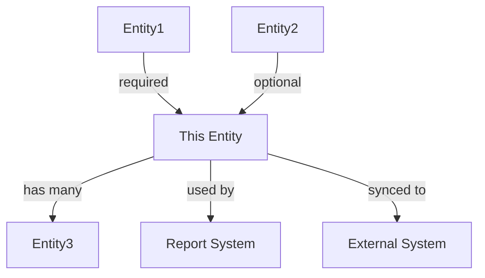
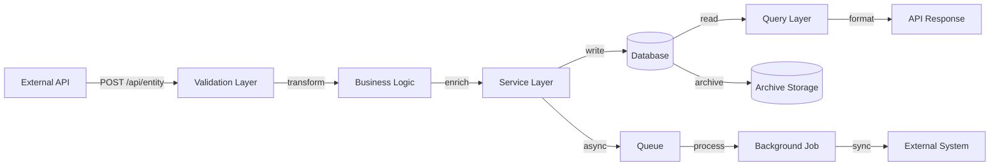

# Data Flow Analysis Command

Trace how specific data moves through the entire system - from where it enters, through all transformations, to where it's stored or output. This helps understand data pipelines, transformations, and dependencies.

## Objective

For a given data entity or type, map its complete journey through the system:
- Entry points (APIs, file uploads, integrations)
- All transformations and enrichments
- Storage locations (databases, caches, files)
- Output destinations (APIs, reports, external systems)
- Access patterns (who reads/writes it)

## Step 1: Data Entity Identification

### If Entity Specified
- Find the entity definition (model, schema, type)
- Identify all fields and their types
- Note any computed or derived fields

### If No Entity Specified
- List main data entities in the system
- Suggest which to analyze based on:
  - Core business entities
  - Entities with complex transformations
  - Data that flows between multiple systems

### Output Format
```markdown
## Data Entity: [EntityName]

**Definition Location**: `file_path:line_number`

**Schema**:
```typescript
interface EntityName {
  id: string;           // Primary identifier
  field1: string;       // [Purpose]
  field2: number;       // [Purpose]
  computed: boolean;    // Derived from [source]
  relations: {
    relatedEntity: RelatedType;
  };
}
```

**Business Purpose**: [What this data represents in business terms]

**Data Classification**:
- **Sensitivity**: [Public/Internal/Confidential/PII]
- **Lifecycle**: [How long it's retained]
- **Compliance**: [Any regulatory requirements]
```

## Step 2: Data Entry Points

Identify all ways data enters the system:

### Entry Point Types
- API endpoints (POST/PUT requests)
- File uploads
- Data imports/migrations
- External system integrations
- User input forms
- Scheduled data fetches
- Event consumers

### Output Format
```markdown
## Data Entry Points

### Entry Point 1: [Name]
**Type**: [API/Upload/Integration/etc.]
**Location**: `file_path:line_number`

**How Data Arrives**:
```json
{
  "rawField1": "value",
  "rawField2": 123,
  "sourceSystem": "external-api"
}
```

**Validation Applied**:
- ✓ Type checking: [What's validated]
- ✓ Business rules: [What's enforced]
- ✗ Missing validation for: [What's not checked]
- Location: `file_path:line_number`

**Initial Transformation**:
- [Transformation 1] at `file_path:line_number`
- [Transformation 2] at `file_path:line_number`

**After Entry Processing**:
```json
{
  "id": "generated-uuid",
  "field1": "NORMALIZED_VALUE",
  "field2": 123,
  "status": "pending",
  "createdAt": "2024-01-01T00:00:00Z"
}
```

**Error Handling**:
- Invalid data: [How it's handled]
- Duplicate detection: [Yes/No] at `file_path:line_number`
- Partial data: [How it's handled]

**Volume/Frequency**:
- Estimated: [X] records per [time period]
- Peak times: [When]
```

## Step 3: Data Transformations

Map all transformations data undergoes:

### Transformation Types
- Normalization (format standardization)
- Enrichment (adding computed fields)
- Aggregation (combining data)
- Filtering (removing fields)
- Type conversion
- Business rule application

### Output Format
```markdown
## Data Transformations

### Transformation 1: [Name]
**Location**: `file_path:line_number`
**Trigger**: [When this transformation occurs]
**Purpose**: [Why this transformation is needed]

**Input**:
```json
{
  "before": "value"
}
```

**Transformation Logic**:
```language
// Business logic:
function transformData(input) {
  // [Explanation of what happens]
  return {
    normalized: input.before.toUpperCase(),
    validated: checkBusinessRule(input),
    enriched: fetchAdditionalData(input.id)
  };
}
```

**Output**:
```json
{
  "normalized": "VALUE",
  "validated": true,
  "enriched": {
    "additionalField": "data"
  }
}
```

**Business Rules Applied**:
- [Rule 1]: [Description]
- [Rule 2]: [Description]

**Data Loss**: [Any fields dropped or information lost]
**Data Gain**: [Any fields added or information created]

**Side Effects**:
- [Any other data updated]
- [Any events triggered]
- [Any logs created]

**Reversibility**: [Can this transformation be undone?]
- ✓ Reversible: Original data preserved in [location]
- ✗ Irreversible: Original data overwritten
```

## Step 4: Data Storage

Identify all places data is persisted:

### Storage Locations
- Primary database tables
- Cache layers
- Document stores
- File systems
- Archive storage
- Backups

### Output Format
```markdown
## Data Storage

### Storage 1: [Database Table / Cache / etc.]
**Type**: [Relational DB/NoSQL/Cache/File/etc.]
**Location**: [Database name / File path]
**Definition**: `file_path:line_number` (schema/model)

**Schema**:
```sql
CREATE TABLE entity_name (
    id UUID PRIMARY KEY,
    field1 VARCHAR(255) NOT NULL,
    field2 INTEGER,
    status VARCHAR(50),
    created_at TIMESTAMP DEFAULT NOW(),
    updated_at TIMESTAMP,

    CONSTRAINT status_check CHECK (status IN ('pending', 'active', 'archived')),
    INDEX idx_status (status),
    INDEX idx_created_at (created_at)
);
```

**Indexes**:
- Primary key: `id`
- Indexed fields: `status`, `created_at`
- Performance impact: [Query performance notes]

**Constraints**:
- NOT NULL: [fields]
- UNIQUE: [fields]
- CHECK: [constraints]
- Foreign keys: [relationships]

**Stored Representation**:
```json
{
  "id": "uuid",
  "field1": "stored value",
  "field2": 123,
  "status": "active"
}
```

**Access Patterns**:
- **Write operations**: [How often data is written]
  - INSERT: `file_path:line_number`
  - UPDATE: `file_path:line_number`
  - DELETE: `file_path:line_number`

- **Read operations**: [How often data is read]
  - By ID: `file_path:line_number`
  - By status: `file_path:line_number`
  - List queries: `file_path:line_number`

**Data Volume**:
- Current: [Estimated row count]
- Growth rate: [Records per day/month]
- Retention period: [How long data is kept]

**Backup/Recovery**:
- Backup frequency: [How often]
- Point-in-time recovery: [Available/Not available]
- Archive policy: [Description]
```

## Step 5: Data Retrieval and Access

Map who/what accesses this data:

### Access Patterns
- API queries
- Report generation
- Background jobs
- Analytics systems
- External system access

### Output Format
```markdown
## Data Access Patterns

### Access Pattern 1: [Name]
**Purpose**: [Why this data is accessed]
**Location**: `file_path:line_number`
**Type**: [Read/Write/Update/Delete]

**Query**:
```sql
SELECT field1, field2, field3
FROM entity_name
WHERE status = 'active'
  AND created_at > NOW() - INTERVAL '30 days'
ORDER BY created_at DESC
LIMIT 100;
```

**Filters Applied**:
- Status: [Filter logic]
- Date range: [Filter logic]
- User permissions: [Authorization logic]

**Joins/Relations**:
- Joined with: [Related entities]
- Join type: [INNER/LEFT/etc.]
- Performance: [Notes on query performance]

**Data Retrieved**:
```json
{
  "id": "uuid",
  "field1": "value",
  "field2": 123,
  // Relations loaded:
  "relatedEntity": {
    "field": "value"
  }
}
```

**Post-Processing**:
- [Additional filtering after query]
- [Data transformation for response]
- [Permission-based field removal]

**Caching**:
- ✓ Cached for [duration] at `file_path:line_number`
- ✗ Not cached
- Cache key: [How cache key is generated]
- Cache invalidation: [When cache is cleared]

**Authorization**:
- [Who can access this data]
- [Permission checks applied]
- Location: `file_path:line_number`

**Usage Frequency**:
- Calls per day: [Estimated]
- Peak times: [When]
- Response time: [Average]
```

## Step 6: Data Mutations

Track how data changes over its lifetime:

### Mutation Types
- Updates triggered by user actions
- Scheduled updates
- Cascade updates from related data
- State transitions
- Soft deletes

### Output Format
```markdown
## Data Mutations

### Mutation: [Description]
**Trigger**: [What causes this mutation]
**Location**: `file_path:line_number`

**Fields Modified**:
| Field | Before | After | Business Reason |
|-------|--------|-------|-----------------|
| status | 'pending' | 'approved' | [Why] |
| approvedBy | null | userId | [Why] |
| approvedAt | null | timestamp | [Why] |

**Business Rules**:
- Can only transition from [state] to [state]
- Requires [permission] to modify
- Validates [condition] before mutation

**Code**:
```language
function updateStatus(id, newStatus, userId) {
  // Validation
  if (!canTransition(currentStatus, newStatus)) {
    throw new Error("Invalid state transition");
  }

  // Mutation
  return update({
    status: newStatus,
    approvedBy: userId,
    approvedAt: new Date(),
    updatedAt: new Date()
  });
}
```

**Side Effects**:
- Updates related entity: [Entity name] at `file_path:line_number`
- Sends notification to: [Recipients]
- Publishes event: [Event name]
- Logs audit entry at `file_path:line_number`

**Cascade Behavior**:
- [What happens to related data]

**Reversibility**:
- ✓ Can be undone by [action]
- ✗ Cannot be undone - permanent change
- ⚠️ Partially reversible - [details]

**Audit Trail**:
- ✓ All changes logged to [location]
- ✗ No audit trail
- Fields tracked: [Which fields are audited]
```

## Step 7: Data Output and Export

Identify where data leaves the system:

### Output Destinations
- API responses
- File exports
- Reports
- External system syncs
- Email/notifications
- Data feeds

### Output Format
```markdown
## Data Outputs

### Output 1: [Name]
**Purpose**: [Why data is exported]
**Location**: `file_path:line_number`
**Destination**: [Where data goes]

**Selection Criteria**:
- [What data is included]
- [Filters applied]

**Output Format**:
```json
{
  "id": "uuid",
  "publicField1": "value",
  // Note: sensitive fields excluded
  "transformedField": "value"
}
```

**Transformations for Output**:
- [Field mapping]
- [Format conversion]
- [Sensitive data redaction]

**Data Sanitization**:
- ✓ PII removed/masked: [fields]
- ✓ Sensitive data excluded: [fields]
- [Compliance requirements met]

**Frequency**:
- Real-time / Scheduled
- [How often data is exported]

**Volume**:
- Records per export: [count]
- Data size: [MB/GB]

**Recipient Processing**:
- [What the recipient does with this data]
- [How they expect it formatted]
- [SLA/timing requirements]
```

## Step 8: Data Lifecycle

Map the complete lifecycle:

```markdown
## Data Lifecycle

### Stages

**1. Creation**
- **Entry point**: [Where data originates]
- **Initial state**: [Default values]
- **Location**: `file_path:line_number`

**2. Active Use**
- **Duration**: [How long data remains active]
- **Mutations**: [How it changes]
- **Access pattern**: [Who uses it]

**3. Archival** (if applicable)
- **Trigger**: [When data is archived]
- **Archive location**: [Where archived data goes]
- **Access**: [Can archived data be retrieved?]
- **Location**: `file_path:line_number`

**4. Deletion**
- **Trigger**: [When data is deleted]
- **Type**: Soft delete / Hard delete
- **Retention**: [How long before permanent deletion]
- **Cascade**: [What related data is also deleted]
- **Location**: `file_path:line_number`

### Lifecycle Diagram


### Compliance & Retention
- **Regulatory requirements**: [GDPR/HIPAA/etc.]
- **Retention policy**: [Duration and rules]
- **Right to deletion**: [How user deletion requests are handled]
- **Data residency**: [Where data must be stored]
```

## Step 9: Data Dependencies

Identify what other data depends on this entity:

```markdown
## Data Dependencies

### Upstream Dependencies (What this data depends on)
- **[Entity1]**: [Relationship description]
  - Foreign key: `entity1_id`
  - Cascade: [Behavior if parent deleted]
  - Required: Yes/No

- **[Entity2]**: [Relationship description]
  - Reference: [How referenced]
  - Validation: [Referential integrity enforced?]

### Downstream Dependencies (What depends on this data)
- **[Entity3]**: [Relationship description]
  - Foreign key in child: `this_entity_id`
  - Cascade delete: Yes/No
  - Orphan handling: [What happens if this is deleted]

- **[Report/Feature]**: [Description]
  - Breaks if this data: [Deleted/Modified/etc.]
  - Criticality: [High/Medium/Low]

### Dependency Graph

```

## Step 10: Data Quality and Validation

Assess data quality controls:

```markdown
## Data Quality

### Validation Rules

**At Entry** (`file_path:line_number`):
- ✓ Type validation: [Fields checked]
- ✓ Format validation: [Regex/pattern checks]
- ✓ Range validation: [Min/max checks]
- ✗ Missing validation: [What's not checked]

**Business Rules** (`file_path:line_number`):
- [Rule 1]: [Description and enforcement point]
- [Rule 2]: [Description and enforcement point]

**Data Integrity Checks** (`file_path:line_number`):
- Uniqueness: [Which fields must be unique]
- Referential integrity: [Foreign key validation]
- Consistency: [Cross-field validation]

### Data Quality Issues

**Known Issues**:
- [Issue 1]: [Description and impact]
  - Affected records: [count or percentage]
  - Root cause: [Why this occurs]
  - Mitigation: [How it's handled]

- [Issue 2]: [Description and impact]

**Data Cleaning**:
- ✓ Automated cleaning: [What's automatically fixed]
- Manual review required for: [What needs human intervention]
- Quarantine process: [How bad data is isolated]

### Monitoring

**Data Quality Metrics**:
- Completeness: [Percentage of required fields filled]
- Accuracy: [How accuracy is measured]
- Consistency: [Duplicate rate, etc.]
- Timeliness: [Data freshness]

**Alerts**:
- [Alert 1]: Triggered when [condition]
- [Alert 2]: Triggered when [condition]
```

## Step 11: Data Flow Summary

Provide complete end-to-end visualization:

```markdown
# Data Flow Summary: [EntityName]

## Visual Flow Diagram



## Flow Statistics

**Entry Points**: [count]
**Transformations**: [count]
**Storage Locations**: [count]
**Output Destinations**: [count]
**Access Patterns**: [count]

## Critical Paths

### Most Important Flow: [Name]
**Why Critical**: [Business importance]
**Volume**: [X] operations per [time]
**SLA**: [Performance requirement]

**Flow Steps**:
1. [Step 1] - [Duration]
2. [Step 2] - [Duration]
3. [Step 3] - [Duration]

**Total Time**: [Duration]

**Failure Impact**: [What happens if this fails]

## Risk Assessment

**Data Loss Risks**:
- [Risk 1 and mitigation]
- [Risk 2 and mitigation]

**Data Corruption Risks**:
- [Risk 1 and mitigation]
- [Risk 2 and mitigation]

**Performance Bottlenecks**:
- [Bottleneck 1] at `file_path:line_number`
- [Bottleneck 2] at `file_path:line_number`

**Security Concerns**:
- [Concern 1 and mitigation]
- [Concern 2 and mitigation]

## Recommendations

### Immediate Actions
1. [Action to address critical issue]
2. [Action to improve reliability]

### Improvements
1. [Optimization opportunity]
2. [Better validation needed]
3. [Documentation gap]

### Monitoring Gaps
- [What should be monitored but isn't]
- [Alerts that should exist]
```

## Important Guidelines

- **Follow the data** - Trace actual data flow, not just code flow
- **Track transformations** - Show how data changes at each step
- **Include timing** - Note when async operations occur
- **Show volume** - Include data volume and frequency
- **Document validation** - Note what's checked and what isn't
- **Identify risks** - Highlight data loss or corruption risks
- **Think about scale** - Consider performance at high volume

---

**Begin by identifying the data entity and tracing from all entry points to final outputs.**
