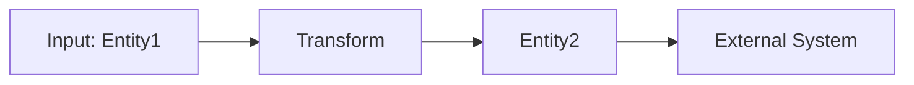
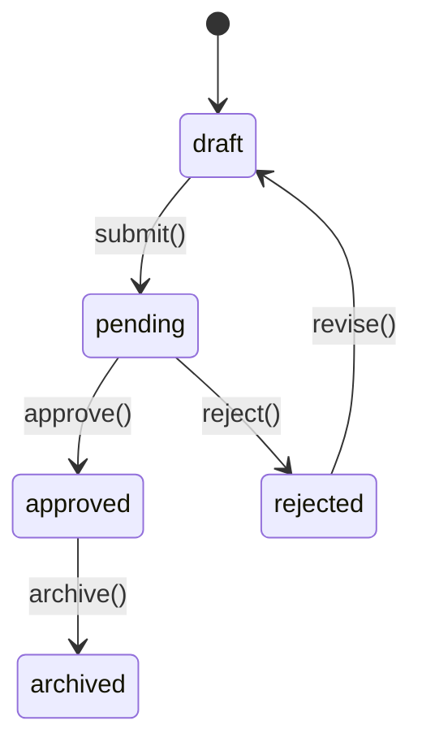
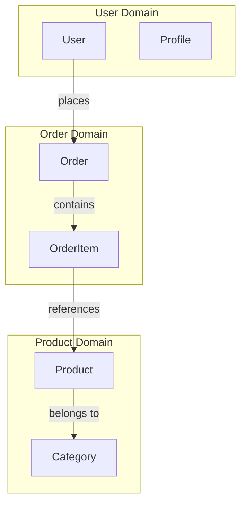

# Domain Discovery Command

Rapidly understand the business domains and entity structure of an unfamiliar codebase. This command is perfect for initial exploration when you have no context about what the system does.

## Objective

Quickly identify what business domains exist, what entities the system manages, and how they relate to each other. Think of this as creating a "business map" of the codebase.

## Step 1: Quick Discovery Scan

### Identify Entry Points
- Main application files (main.*, app.*, index.*)
- Configuration files (package.json, requirements.txt, pom.xml, etc.)
- Routing/endpoint definitions
- Database schema files
- API documentation if present

### Technology Detection
- Framework and language
- Database type
- API style (REST, GraphQL, gRPC, etc.)
- Frontend framework (if applicable)

## Step 2: Entity Identification

Find all business entities in the codebase:

### Where to Look
- Database models/schemas
- API response structures
- TypeScript interfaces / Java classes / Python classes
- GraphQL schemas
- ORM model definitions
- Serializers and DTOs

### Entity Extraction
For each entity found, document:

```markdown
## Entity: [EntityName]

**File Location**: `file_path:line_number`

**Description**: [Infer what this entity represents in business terms]

**Attributes**:
| Field Name | Type | Required | Description |
|------------|------|----------|-------------|
| id | string | yes | Unique identifier |
| name | string | yes | [Inferred purpose] |
| status | enum | yes | [Possible values: draft, active, archived] |
| createdAt | datetime | yes | Creation timestamp |

**Business Purpose**: [What business problem or concept this entity models]

**Lifecycle**: [How this entity is created, updated, and deleted]
```

## Step 3: Relationship Mapping

Identify how entities relate to each other:

### Relationship Types
- One-to-Many (User has many Orders)
- Many-to-Many (Students have many Courses, Courses have many Students)
- One-to-One (User has one Profile)
- Hierarchical (Comment has parent Comment)
- Polymorphic relationships

### Output Format
```markdown
## Entity Relationships

### [Entity1] → [Entity2]
**Type**: One-to-Many
**Relationship**: [Entity1] has many [Entity2]
**Foreign Key**: [field_name]
**Business Meaning**: [Explain in business terms]
**Code Location**: `file_path:line_number`
**Cascade Behavior**: [What happens when parent is deleted]

**Business Rules**:
- [Any constraints or validations on this relationship]
```

## Step 4: Domain Boundary Identification

Group related entities into business domains:

### Domain Clustering
Look for logical groupings based on:
- Directory structure (users/, orders/, payments/)
- Database schema namespaces
- Shared terminology and naming patterns
- Functional cohesion (entities that are used together)

### Bounded Contexts
Identify if the same term means different things in different parts of the system (e.g., "User" in authentication vs "User" in billing).

### Output Format
```markdown
## Business Domain: [DomainName]

**Purpose**: [What business capability this domain provides]

**Core Entities**:
- [Entity1] - [Brief description]
- [Entity2] - [Brief description]
- [Entity3] - [Brief description]

**Key Responsibilities**:
- [Responsibility 1]
- [Responsibility 2]

**Entry Points** (How users/systems interact with this domain):
- API endpoints: [List key endpoints]
- UI components: [List key screens/pages]
- Events published: [Domain events]
- Events consumed: [Events from other domains]

**External Dependencies**:
- [Other domains this depends on]
- [External services/APIs]

**Files/Directories**:
- `path/to/domain/files`

**Business Terminology**:
| Term | Meaning in this Domain |
|------|------------------------|
| [term1] | [definition] |
| [term2] | [definition] |
```

## Step 5: Data Flow Analysis

Understand how data moves between domains:

### Trace Key Flows
- How does data enter the system? (APIs, uploads, integrations)
- How is data transformed between domains?
- Where is data persisted?
- What data is sent to external systems?

### Output Format
```markdown
## Cross-Domain Data Flow: [FlowName]

**Trigger**: [What initiates this flow]

**Flow Steps**:
1. **[Domain1]**: [What happens]
   - Entities involved: [Entity1, Entity2]
   - Data transformation: [Description]
   - Location: `file_path:line_number`

2. **[Domain2]**: [What happens]
   - Entities involved: [Entity3]
   - Data transformation: [Description]
   - Location: `file_path:line_number`

3. **[Domain3]**: [What happens]
   - Entities involved: [Entity4, Entity5]
   - Data transformation: [Description]
   - Location: `file_path:line_number`

**Data Diagram**:

```

## Step 6: API Surface Discovery

Map all ways external systems interact with this codebase:

### Public APIs
- REST endpoints
- GraphQL queries/mutations
- gRPC services
- WebSocket events
- CLI commands
- Scheduled jobs

### Output Format
```markdown
## API Inventory

### Endpoint: `[METHOD] /path/to/endpoint`
**Domain**: [Which business domain this belongs to]
**Purpose**: [What business operation this performs]
**Entities Affected**: [Which entities are read/written]
**Authentication**: [Required/Optional/None]
**Key Parameters**: [Important request parameters]
**Response**: [What data is returned]
**Location**: `file_path:line_number`

**Business Use Case**: [When would someone call this API?]
```

## Step 7: State and Lifecycle Discovery

Identify entity lifecycles and state machines:

### State Detection
Look for:
- Status/state enums
- State transition logic
- Lifecycle hooks (beforeCreate, afterUpdate, etc.)
- State validation rules

### Output Format
```markdown
## Entity Lifecycle: [EntityName]

**States**: [draft, pending, approved, rejected, archived]

**State Transitions**:


**Transition Rules**:
| From State | To State | Trigger | Conditions | Location |
|------------|----------|---------|------------|----------|
| draft | pending | submit() | all required fields filled | `file:line` |
| pending | approved | approve() | user has permission | `file:line` |

**State-Dependent Behaviors**:
- **draft**: Can be edited, not visible to others
- **pending**: Read-only, awaiting approval
- **approved**: Visible to all, triggers notification
```

## Step 8: Business Glossary Creation

Create a dictionary of business terms found in the code:

### Terminology Extraction
Look for:
- Enum values
- Constant names
- Type names
- Field names with business meaning
- Comments with business context

### Output Format
```markdown
## Business Glossary

| Term | Definition | Used In | Code Reference |
|------|------------|---------|----------------|
| Premium User | User with paid subscription | User domain | `models/user.ts:45` |
| Order Fulfillment | Process of completing an order | Order domain | `services/order-service.ts:123` |
| Churn Rate | Percentage of cancelled subscriptions | Analytics | `reports/metrics.ts:89` |
| Grace Period | Days allowed after subscription expires | Billing | `config/constants.ts:15` |
```

## Step 9: Architecture Pattern Detection

Identify the architectural patterns used:

### Pattern Recognition
- Layered architecture (Controller → Service → Repository)
- Domain-Driven Design
- Microservices
- Event-driven
- CQRS (Command Query Responsibility Segregation)
- Hexagonal/Clean Architecture

### Output Format
```markdown
## Architecture Patterns

**Primary Pattern**: [Pattern Name]

**Layer Structure**:
1. **[Layer1 Name]** (e.g., Controllers)
   - Responsibility: [What this layer does]
   - Location: [Directories/files]
   - Communicates with: [Other layers]

2. **[Layer2 Name]** (e.g., Services)
   - Responsibility: [What this layer does]
   - Location: [Directories/files]
   - Communicates with: [Other layers]

3. **[Layer3 Name]** (e.g., Repositories)
   - Responsibility: [What this layer does]
   - Location: [Directories/files]
   - Communicates with: [Other layers]

**Domain Boundaries**: [How domains are separated]
**Communication Patterns**: [How domains/modules communicate]
```

## Step 10: Summary Report

Provide a comprehensive domain map:

```markdown
# Domain Discovery Report

## Executive Summary

**System Type**: [E-commerce platform / CRM / Analytics tool / etc.]

**Primary Business Purpose**: [One paragraph explaining what this system does from a business perspective]

**Technology Stack**: [Key technologies]

## Domain Overview

**Total Domains Identified**: [count]
**Total Entities Identified**: [count]
**Total API Endpoints**: [count]

### Domain Map


## Core Entities Summary

| Entity | Domain | Purpose | Key Relationships |
|--------|--------|---------|-------------------|
| [Entity1] | [Domain] | [Purpose] | [Relationships] |
| [Entity2] | [Domain] | [Purpose] | [Relationships] |

## Business Capabilities

This system provides the following business capabilities:

1. **[Capability 1]**
   - Domains involved: [Domain1, Domain2]
   - Key entities: [Entity1, Entity2]
   - Entry points: [API endpoints / UI screens]

2. **[Capability 2]**
   - Domains involved: [Domain3]
   - Key entities: [Entity3, Entity4]
   - Entry points: [API endpoints / UI screens]

## Critical Business Entities

### Most Important Entities (By Relationships)
1. **[Entity Name]** - [X relationships] - [Why it's central]
2. **[Entity Name]** - [X relationships] - [Why it's central]
3. **[Entity Name]** - [X relationships] - [Why it's central]

### High-Risk Entities
[Entities that have complex state management or many dependencies]

## Integration Points

**External Systems Connected**:
- [System1] - [Purpose] - [Data exchanged]
- [System2] - [Purpose] - [Data exchanged]

**Third-Party Services**:
- [Service1] - [Purpose]
- [Service2] - [Purpose]

## Next Steps for Understanding This Codebase

1. **Deep Dive Recommendations**:
   - Explore [Domain1] - [Why this is important to understand first]
   - Review [Entity1] lifecycle - [Why this is critical]
   - Trace [specific workflow] - [Business importance]

2. **Questions for Business Stakeholders**:
   - [Question about unclear business rule]
   - [Question about entity relationship]
   - [Question about expected behavior]

3. **Recommended Commands to Run Next**:
   - `/business-logic-map` - To understand detailed business rules
   - `/workflow-tracer [workflow-name]` - To trace specific processes
   - `/data-dependency-graph` - To visualize data dependencies

## Knowledge Gaps

**Areas Needing Clarification**:
- [Entity or domain where business purpose is unclear]
- [Unusual patterns that need explanation]
- [Complex relationships that need validation]

## Risk Assessment

**Complexity Hotspots**:
- [Area with high coupling or complexity]
- [Entities with many relationships]
- [Unclear domain boundaries]

**Documentation Gaps**:
- [Critical entities without documentation]
- [Complex logic without explanation]
```

## Important Guidelines

### Discovery Principles
- **Speed over perfection** - Provide a quick but useful map
- **Business language** - Explain in terms business people understand
- **Visual aids** - Use Mermaid diagrams extensively
- **Confidence levels** - Mark inferences vs definite findings
- **Prioritize breadth** - Cover all domains before going deep

### What Makes a Good Discovery Report
- A non-technical person can understand what the system does
- A new developer knows where to start exploring
- Business domains are clearly separated
- Entity purposes are clear from business context
- Key workflows are identified
- Integration points are documented

### Time Management
- Spend 20% of time on each domain (scan all before deep-diving)
- Use code structure and naming to infer purpose
- Don't get stuck on complex logic - flag it for later
- Prioritize user-facing features over background jobs

---

**Begin by scanning the codebase structure and proceed systematically through entity discovery and domain mapping.**
