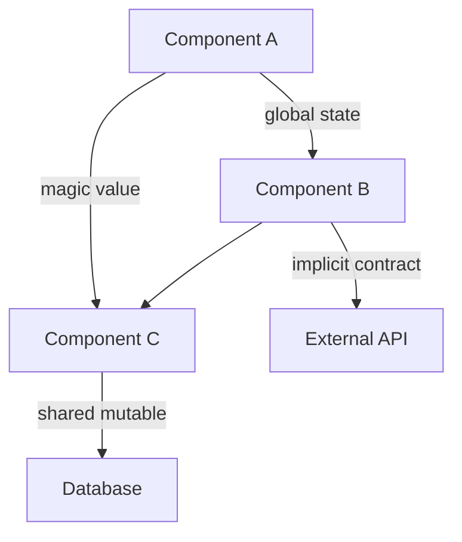

# Hidden Dependencies Discovery Command

Uncover hidden dependencies, implicit contracts, and non-obvious couplings that aren't immediately apparent from the code structure. These are the things that make changes risky and break unexpectedly.

## Objective

Identify all the non-obvious ways different parts of the codebase depend on each other, including:
- Implicit data contracts
- Shared global state
- Ordering dependencies
- Temporal coupling
- Hidden assumptions
- Magic values and configurations

## Step 1: Global State Analysis

Find all shared mutable state:

### Types of Global State
- Global variables and singletons
- Static class fields
- Module-level state
- Environment variables that affect behavior
- Database connection pools
- Caches and memoization
- Feature flags

### Output Format
```markdown
## Global State Dependencies

### Global: [Name]
**Location**: `file_path:line_number`
**Type**: [Variable/Singleton/Cache/etc.]
**Mutability**: Read-only / Mutable

**What It Stores**: [Description of the data]

**Written By**:
- `file_path:line_number` - [Context]
- `file_path:line_number` - [Context]

**Read By**:
- `file_path:line_number` - [Usage context]
- `file_path:line_number` - [Usage context]
- [X more locations]

**Risk Assessment**:
- **Concurrency Issues**: [Thread-safety concerns]
- **Testing Difficulty**: [Hard to test because...]
- **Change Impact**: [What breaks if this changes]

**Hidden Assumptions**:
- [Assumption 1 about this state]
- [Assumption 2 about this state]
```

## Step 2: Implicit Data Contracts

Identify places where code assumes specific data formats or structures:

### Contract Types
- Expected JSON structures
- Database schema assumptions
- API response formats
- File formats
- String encoding assumptions
- Timezone assumptions

### Output Format
```markdown
## Implicit Data Contracts

### Contract: [Description]
**Location**: `file_path:line_number`

**Assumed Structure**:
```json
{
  "field1": "string",
  "nested": {
    "field2": 123
  }
}
```

**Where It's Assumed**:
- `file_path:line_number` - Expects field1 to exist
- `file_path:line_number` - Assumes nested.field2 is a number
- `file_path:line_number` - Relies on specific order

**Not Validated**:
- ✗ No null checks for nested object
- ✗ No type validation for field2
- ✗ No handling for missing fields

**Breaking Changes Would Affect**:
- [List of dependent code locations]

**Recommendation**:
- Add schema validation at: `file_path:line_number`
- Define explicit TypeScript interface / JSON Schema
- Add defensive null checks
```

## Step 3: Ordering Dependencies

Find code that depends on execution order:

### Ordering Issues
- Initialization order dependencies
- Migration file sequencing
- Event handler registration order
- Middleware ordering
- CSS rule ordering
- Import statement ordering

### Output Format
```markdown
## Ordering Dependencies

### Dependency: [Description]
**Type**: [Initialization/Migration/Event/etc.]

**Required Order**:
1. `file_path:line_number` - [Must run first because...]
2. `file_path:line_number` - [Must run second because...]
3. `file_path:line_number` - [Must run third because...]

**What Happens If Order Changes**:
- [Potential failure 1]
- [Potential failure 2]

**Why Order Matters**:
- [Explanation of dependency]

**Current Enforcement**:
- ✓ Enforced by: [Naming convention / Config / etc.]
- ✗ Not enforced, relies on developer knowledge

**Risk Level**: [Low/Medium/High]

**Recommendation**:
- [How to make this more explicit or enforce it]
```

## Step 4: Temporal Coupling

Identify methods that must be called in a specific sequence:

### Temporal Coupling Patterns
- Init/setup methods that must be called first
- Builder pattern sequences
- State machine progressions
- Transaction begin/commit patterns
- Resource acquire/release patterns

### Output Format
```markdown
## Temporal Coupling

### Sequence: [Description]
**Class/Module**: [Name]
**Location**: `file_path:line_number`

**Required Call Sequence**:
```javascript
// MUST be called in this order:
obj.initialize();     // Step 1
obj.configure(opts);  // Step 2 - depends on Step 1
obj.start();          // Step 3 - depends on Step 2
```

**Enforcement**: [How is this order enforced?]
- ✓ Runtime checks throw errors if wrong order
- ✗ No enforcement - relies on documentation
- ⚠️ Partial enforcement

**Failure Modes**:
- If `configure()` called before `initialize()`: [What happens]
- If `start()` called before `configure()`: [What happens]

**Found Violations**: [Any places where this is done incorrectly]
- `file_path:line_number` - [Description of violation]

**Recommendation**:
- Use builder pattern to enforce sequence
- Add state checks to throw errors early
- Combine methods to reduce coupling
```

## Step 5: Configuration Dependencies

Find hidden configuration that affects behavior:

### Configuration Sources
- Environment variables
- Config files
- Feature flags
- Command-line arguments
- Database configuration tables
- Build-time constants

### Output Format
```markdown
## Configuration Dependencies

### Config: [Name]
**Type**: [Environment Variable/Config File/Feature Flag/etc.]
**Location**: [Where it's defined]
**Default Value**: [Value if not set]

**Affects Behavior In**:
- `file_path:line_number` - [How behavior changes]
- `file_path:line_number` - [How behavior changes]

**Possible Values**: [Range or enum of values]

**Business Impact**:
- [What business functionality depends on this]

**Documentation**: [Is this documented?]
- ✓ Documented in: [Location]
- ✗ Undocumented
- ⚠️ Partially documented

**Discovery Risk**: [How hard is it to find this dependency?]
- **High**: Hidden in multiple files, no central configuration
- **Medium**: Documented but spread across files
- **Low**: Centrally configured and documented

**Testing**: [How is this tested?]
- ✓ Tests cover different config values
- ✗ Tests only use default values
```

## Step 6: Magic Values and Constants

Identify magic values that encode business logic:

### Magic Value Types
- Hardcoded strings that match business data
- Magic numbers in calculations
- Status code constants
- Timeout values
- Threshold values
- Regular expressions

### Output Format
```markdown
## Magic Values

### Magic Value: `[value]`
**Location**: `file_path:line_number`
**Type**: [Number/String/Regex/etc.]

**Context**:
```language
if (status === "ACTIVE_PENDING_REVIEW") {  // Magic string
    // ...
}
```

**Business Meaning**: [What this value represents in business terms]

**Used In**:
- `file_path:line_number` - [Usage 1]
- `file_path:line_number` - [Usage 2]
- [X more locations]

**Consistency Check**:
- ✓ Same value used consistently
- ✗ Variations found:
  - "ACTIVE_PENDING_REVIEW" in `file1:10`
  - "active_pending_review" in `file2:20`
  - "ActivePendingReview" in `file3:30`

**Defined As Constant**: [Yes/No]
- If No: **Risk** of typos and inconsistency

**Recommendation**:
- Extract to named constant: `STATUS_ACTIVE_PENDING_REVIEW`
- Define in central location: `constants/statuses.ts`
- Add TypeScript enum or union type
```

## Step 7: Database Schema Dependencies

Identify implicit dependencies on database structure:

### Schema Dependencies
- Hardcoded table names
- Column name strings
- Query result structure assumptions
- Foreign key relationships not enforced in code
- Database constraints not validated in code

### Output Format
```markdown
## Database Schema Dependencies

### Dependency: [Description]
**Location**: `file_path:line_number`

**Assumed Schema**:
```sql
-- Code assumes this structure exists:
CREATE TABLE users (
    id INT PRIMARY KEY,
    email VARCHAR(255),
    status VARCHAR(50)
);
```

**Hardcoded References**:
- Table name: "users" at `file_path:line_number`
- Column: "status" at `file_path:line_number`
- Query assumes columns: [list] at `file_path:line_number`

**Schema Changes That Would Break This**:
- Renaming "status" column
- Changing "status" from string to enum
- Adding NOT NULL constraint without default
- Splitting table into multiple tables

**ORM/Type Safety**:
- ✓ Using ORM with type safety
- ✗ Raw SQL strings
- ⚠️ Partial ORM usage with raw queries

**Migration Coordination**:
- [How database migrations coordinate with code changes]
- Risk: [Deployment risks if schema and code are out of sync]
```

## Step 8: External System Contracts

Identify dependencies on external systems:

### External Dependencies
- Third-party APIs
- Microservices
- Message queues
- File system structure
- Network topology

### Output Format
```markdown
## External System Dependencies

### External System: [Name]
**Purpose**: [What this system provides]
**Type**: [REST API/GraphQL/gRPC/Message Queue/etc.]

**Implicit Contracts**:

#### Contract 1: [Description]
**Assumption**: [What we assume about the external system]
**Location**: `file_path:line_number`

**Expected Response Format**:
```json
{
  "data": [...],
  "status": "success"
}
```

**Code Assumes**:
- Response always has "data" field
- Status is always a string
- Specific status values: ["success", "error"]
- Response time < 5 seconds

**Not Validated**:
- ✗ No schema validation
- ✗ No timeout handling
- ✗ Assumes synchronous response

**Breaking Changes We're Vulnerable To**:
- External API changes response structure
- New required fields added
- Rate limiting introduced
- Response format changes

**Versioning**: [How is API versioning handled?]
- ✓ Using versioned endpoints
- ✗ No versioning
- ⚠️ Version hardcoded

**Error Handling**: [How are external failures handled?]
- Retry logic: [Yes/No] at `file_path:line_number`
- Fallback: [Yes/No] at `file_path:line_number`
- Circuit breaker: [Yes/No]
```

## Step 9: Transitive Dependencies

Find indirect dependencies through chains:

### Transitive Dependency Patterns
- A depends on B, B depends on C, therefore A depends on C
- Shared utility functions that couple unrelated code
- Common models that create unwanted dependencies

### Output Format
```markdown
## Transitive Dependencies

### Chain: [A → B → C]

**Direct Dependency**: [A] depends on [B]
- Location: `file_path:line_number`
- Reason: [Why A needs B]

**Indirect Dependency**: [B] depends on [C]
- Location: `file_path:line_number`
- Reason: [Why B needs C]

**Result**: [A] is now coupled to [C]
- Impact: Changes to [C] can break [A]
- Risk: [A] may not be tested when [C] changes

**Dependency Distance**: [X] levels deep

**Recommendation**:
- [How to reduce this transitive dependency]
- Consider: Dependency inversion
- Consider: Extracting interface
```

## Step 10: Shared Mutable Data

Find data structures modified by multiple parts of the system:

### Shared Mutable Patterns
- Objects passed by reference and modified
- Arrays that multiple functions push to
- Shared caches
- Request/response objects modified by middleware

### Output Format
```markdown
## Shared Mutable Data

### Shared: [Data Structure Name]
**Type**: [Object/Array/Map/etc.]
**Location**: `file_path:line_number`

**Modified By**:
1. `file_path:line_number` - [What it modifies]
   ```language
   [Code snippet showing modification]
   ```

2. `file_path:line_number` - [What it modifies]
   ```language
   [Code snippet showing modification]
   ```

**Read By**: [X] locations

**Mutation Types**:
- Direct property assignment
- Array push/pop
- Nested object modification
- Deletion of properties

**Concurrency Risks**:
- ⚠️ Multiple async operations modify same data
- ⚠️ No locking mechanism
- ✓ Single-threaded, no concurrency issues

**Testing Difficulty**: [High/Medium/Low]
- [Why it's hard to test]

**Recommendation**:
- Make immutable - return new object instead of modifying
- Use defensive copying
- Add explicit ownership/lifecycle management
```

## Step 11: Type Coercion and Implicit Conversions

Find places where type conversions create hidden dependencies:

### Type Coercion Issues
- String to number conversions
- Falsy value assumptions
- Null vs undefined handling
- Type assertions that hide issues

### Output Format
```markdown
## Type Coercion Dependencies

### Coercion: [Description]
**Location**: `file_path:line_number`

**Implicit Conversion**:
```language
// Value comes in as string "123"
const total = price + discount;  // Could be "100" + "20" = "10020"
```

**Risk**:
- Input type assumption: [Assumes input is number]
- Actual type: [Could be string from API/user input]
- Result: [Unexpected behavior]

**Examples of Failure**:
- Input "0" treated as falsy when it's a valid value
- String concatenation instead of addition
- Null vs undefined causing different behavior

**Validation Present**: [Yes/No]
- If No: **High Risk** of runtime errors

**Recommendation**:
- Add explicit type checking
- Use TypeScript strict mode
- Validate at boundary
```

## Step 12: Dependency Impact Map

Create a visual representation of dependencies:

```markdown
## Dependency Impact Map

### High-Risk Dependency Clusters

**Cluster 1: [Name]**


**Risk Score**: [High/Medium/Low]
**Number of Dependencies**: [count]
**Types of Coupling**: [List types found in this cluster]

**Why This Is Risky**:
- [Reason 1]
- [Reason 2]

**Recommended Actions**:
1. [Action to reduce coupling]
2. [Action to make dependencies explicit]
3. [Testing improvements]
```

## Summary Report

```markdown
# Hidden Dependencies Analysis Summary

## Overview
**Total Hidden Dependencies Found**: [count]
**Risk Level**: [Low/Medium/High]

## Breakdown by Category
| Category | Count | High Risk | Recommendations |
|----------|-------|-----------|-----------------|
| Global State | [X] | [Y] | [Z] |
| Implicit Contracts | [X] | [Y] | [Z] |
| Ordering Dependencies | [X] | [Y] | [Z] |
| Temporal Coupling | [X] | [Y] | [Z] |
| Magic Values | [X] | [Y] | [Z] |
| Configuration | [X] | [Y] | [Z] |

## Top 10 Riskiest Hidden Dependencies

### 1. [Dependency Description]
- **Location**: `file_path:line_number`
- **Risk**: [Why this is risky]
- **Impact**: [What breaks if this fails]
- **Fix Priority**: [High/Medium/Low]
- **Recommended Action**: [What to do]

### 2. [Dependency Description]
[Similar format...]

## Patterns Identified

### Anti-Pattern: [Name]
**Occurrences**: [count]
**Why It's Problematic**: [Explanation]
**Examples**:
- `file_path:line_number`
- `file_path:line_number`

**How to Fix**:
- [Solution approach]

## Testing Gaps

**Areas with Hidden Dependencies and No Tests**:
- [Area 1] - [Why testing is difficult]
- [Area 2] - [Why testing is difficult]

**Recommended Test Coverage**:
- [Test type 1] for [dependency type]
- [Test type 2] for [dependency type]

## Refactoring Roadmap

### Immediate Actions (Critical)
1. [Action 1] - Addresses [high-risk dependency]
2. [Action 2] - Addresses [high-risk dependency]

### Short-term (2-4 weeks)
1. [Action 1] - Reduces coupling in [area]
2. [Action 2] - Makes [dependency] explicit

### Long-term (1-3 months)
1. [Action 1] - Architectural improvement
2. [Action 2] - Design pattern implementation

## Metrics

**Coupling Score**: [X/10] (lower is better)
- Global state usage: [count]
- Magic values: [count]
- Implicit contracts: [count]

**Change Risk Score**: [X/10] (lower is better)
- High-risk dependencies: [count]
- Transitive dependencies: [count]
- Temporal couplings: [count]
```

## Important Guidelines

- **Don't just find explicit imports** - Look for runtime dependencies
- **Check data flow** - How data moves between components
- **Look for implicit assumptions** - What's not validated
- **Test coverage hints** - Hard-to-test code often has hidden dependencies
- **Change history** - Git blame can reveal what breaks together
- **Production incidents** - Past bugs often reveal hidden dependencies

---

**Begin by scanning for global state and proceed through each dependency type systematically.**
