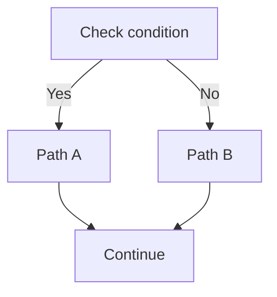
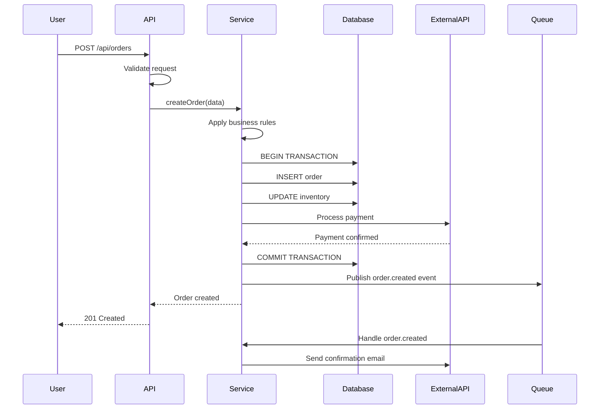

# Workflow Tracer Command

Trace a complete end-to-end workflow through the codebase, showing exactly what happens step-by-step from a business perspective.

## Objective

Given a workflow name, feature, or user action (e.g., "user registration", "checkout process", "order approval"), trace the complete execution path through all layers of the codebase and explain what happens at each step in business terms.

## Step 1: Workflow Identification

### If User Provided a Workflow Name
- Search for relevant API endpoints, event handlers, or functions matching that name
- Identify the entry point (API endpoint, CLI command, scheduled job, event handler)

### If No Workflow Specified
- List common workflows found in the codebase:
  - User authentication/registration
  - CRUD operations for main entities
  - Payment/transaction processing
  - Data import/export
  - Approval/review workflows
  - Notification/alert processes
  - Scheduled batch operations

Ask the user which workflow to trace.

## Step 2: Entry Point Analysis

Document how the workflow is initiated:

```markdown
## Workflow: [Workflow Name]

### Entry Point
**Trigger**: [API call / User action / Scheduled job / Event / etc.]
**Location**: `file_path:line_number`

**For API Endpoint**:
- **Method**: [GET/POST/PUT/DELETE]
- **Path**: `/api/path/to/endpoint`
- **Authentication**: [Required/Optional]
- **Request Format**:
```json
{
  "field1": "value",
  "field2": 123
}
```

**For Event**:
- **Event Name**: [event.name]
- **Event Source**: [Where event is published from]
- **Event Payload**: [Data structure]

**For Scheduled Job**:
- **Schedule**: [cron expression or frequency]
- **Trigger Conditions**: [When it runs]
```

## Step 3: Step-by-Step Trace

Follow the execution path through all code layers:

### Tracing Methodology
1. Start from entry point
2. Follow function calls
3. Track data transformations
4. Identify decision points
5. Note database operations
6. Track external API calls
7. Follow to completion or error states

### Output Format
```markdown
## Execution Flow

### Step 1: [Step Name] - [Layer: Controller/Service/Repository]
**Location**: `file_path:line_number`
**Function**: `functionName(parameters)`

**Business Action**: [What happens from a business perspective]

**Technical Details**:
- Input: [Data received]
- Processing: [What operations are performed]
- Output: [Data produced]

**Business Rules Applied**:
- ✓ [Validation rule 1]
- ✓ [Validation rule 2]
- ✓ [Calculation or transformation]

**Database Operations**:
- Read: [What data is fetched]
- Write: [What data is created/updated]

**Code Snippet**:
```language
[Relevant code showing the key logic]
```

---

### Step 2: [Step Name] - [Layer]
**Location**: `file_path:line_number`
**Function**: `functionName(parameters)`

**Business Action**: [What happens from a business perspective]

**Decision Point**:


**Condition**: [What condition is evaluated]
- If TRUE: [What happens]
  - Location: `file_path:line_number`
- If FALSE: [What happens]
  - Location: `file_path:line_number`

---

### Step 3: [Step Name] - [Layer]
**Location**: `file_path:line_number`

**Business Action**: [What happens from a business perspective]

**External Integration**:
- **Service**: [External API or service name]
- **Purpose**: [Why we call this service]
- **Data Sent**: [Request payload]
- **Data Received**: [Response structure]
- **Error Handling**: [What happens if this fails]
- **Retry Logic**: [How retries are handled]

---

[Continue for all steps...]
```

## Step 4: Data Transformation Tracking

Show how data changes as it flows through the workflow:

```markdown
## Data Evolution

### Initial Input
**Source**: [API request / Event payload / Database query]
```json
{
  "rawField1": "initial value",
  "rawField2": 123
}
```

### After Step 1: [Step Name]
**Transformation**: [What changed and why]
```json
{
  "rawField1": "initial value",
  "rawField2": 123,
  "calculatedField": 456,  // Added by calculation
  "normalizedField1": "INITIAL VALUE"  // Normalized to uppercase
}
```

### After Step 2: [Step Name]
**Transformation**: [What changed and why]
```json
{
  "id": "generated-uuid",  // System-generated ID
  "field1": "initial value",
  "field2": 123,
  "calculatedField": 456,
  "status": "pending",  // Default status set
  "createdAt": "2024-01-01T00:00:00Z"  // Timestamp added
}
```

### Final Output
**Destination**: [Database / API response / Event published]
```json
{
  "id": "generated-uuid",
  "field1": "initial value",
  "field2": 123,
  "status": "pending"
}
```

**Fields Dropped**: [List any fields that were removed and why]
**Fields Added**: [List any fields that were added and their purpose]
```

## Step 5: Decision Points and Branching

Document all conditional logic:

```markdown
## Decision Tree

### Decision 1: [Description]
**Location**: `file_path:line_number`
**Business Question**: [What business decision is being made?]

**Condition**: `if (amount > 1000 && user.status === 'premium')`

**Branches**:

#### Branch A (TRUE): Premium Large Transaction
- **When**: Amount exceeds $1000 AND user is premium
- **Actions**:
  1. Apply premium discount (10%)
  2. Skip manual approval
  3. Send to priority processing queue
- **Next Step**: [Go to Step 5]

#### Branch B (FALSE): Standard Transaction
- **When**: Amount ≤ $1000 OR user is not premium
- **Actions**:
  1. No discount applied
  2. Require manual approval if amount > $500
  3. Send to standard processing queue
- **Next Step**: [Go to Step 6]

**Business Impact**: [Why this decision matters]

---

### Decision 2: [Description]
[Similar format...]
```

## Step 6: Side Effects and Cascading Actions

Identify all side effects that occur during the workflow:

```markdown
## Side Effects

### Primary Action
**Main Operation**: [e.g., Create Order]
**Location**: `file_path:line_number`

### Triggered Side Effects

#### Side Effect 1: Inventory Update
**Trigger**: After order creation
**Location**: `file_path:line_number`
**Action**: Decrement product quantities
**Synchronous**: Yes / No
**Failure Handling**: [How failures are handled]
**Business Impact**: [Why this side effect matters]

#### Side Effect 2: Email Notification
**Trigger**: After order creation
**Location**: `file_path:line_number`
**Action**: Send confirmation email to customer
**Synchronous**: No (queued)
**Failure Handling**: Retry 3 times, then alert admin
**Business Impact**: Customer expects confirmation email

#### Side Effect 3: Analytics Event
**Trigger**: After successful order
**Location**: `file_path:line_number`
**Action**: Track "order_completed" event
**Data Logged**: Order total, user ID, products
**Purpose**: Business metrics and reporting

#### Side Effect 4: Audit Log
**Trigger**: Any order status change
**Location**: `file_path:line_number`
**Action**: Record audit trail entry
**Purpose**: Compliance and debugging
```

## Step 7: Error Handling and Failure Paths

Document how errors are handled:

```markdown
## Error Scenarios

### Error 1: [Error Type]
**Trigger**: [What causes this error]
**Location**: `file_path:line_number`
**Detection**: [How the error is caught]

**Error Handling**:
1. [Immediate action taken]
2. [Data rollback/cleanup]
3. [User notification]
4. [Logging/alerting]

**Recovery**:
- **Automatic**: [Can system auto-recover?]
- **Manual Steps**: [What needs manual intervention?]
- **Data Consistency**: [Is data left in consistent state?]

**User Experience**:
- **HTTP Status**: [Status code returned]
- **Error Message**: [What user sees]
- **Retry Possible**: Yes / No

**Business Impact**: [What this error means for business operations]

---

### Error 2: [Error Type]
[Similar format...]
```

## Step 8: Success Path Visualization

Create a complete visual flow:

```markdown
## Complete Workflow Diagram



### Sequence Breakdown
1. **User → API**: [Description]
2. **API → Service**: [Description]
3. **Service → Database**: [Description]
[etc...]
```

## Step 9: Performance and Timing

Analyze performance characteristics:

```markdown
## Performance Profile

### Estimated Execution Time
- **Happy Path**: ~[X]ms
- **With External Calls**: ~[X]ms
- **Worst Case**: ~[X]ms

### Performance Bottlenecks
1. **External API Call** - `file_path:line_number`
   - Typical latency: [X]ms
   - Timeout setting: [X]ms
   - Impact: [Description]
   - Mitigation: [How it's handled]

2. **Database Query** - `file_path:line_number`
   - Query complexity: [Simple/Complex]
   - Indexed: Yes / No
   - Typical time: [X]ms
   - Optimization opportunity: [If applicable]

### Synchronous vs Asynchronous
- **Synchronous Steps**: [List steps that block user]
- **Asynchronous Steps**: [List steps that run in background]
- **User Wait Time**: [How long user waits for response]

### Scalability Concerns
- [Any operations that don't scale well]
- [N+1 query problems]
- [Missing pagination]
- [Unbounded loops]
```

## Step 10: Business Context and Dependencies

Provide business context:

```markdown
## Business Context

### Workflow Purpose
**Business Goal**: [What business objective this workflow achieves]

**Stakeholders**: [Who cares about this workflow]
- [Stakeholder 1]: [What they need from this]
- [Stakeholder 2]: [What they need from this]

**Frequency**: [How often this workflow executes]
- Per day: ~[X] times
- Peak times: [When it's busiest]
- Volume trends: [Growing/Stable/Declining]

### Business Rules Summary
1. [Rule 1] - [Why this rule exists]
2. [Rule 2] - [Why this rule exists]
3. [Rule 3] - [Why this rule exists]

### Revenue/Compliance Impact
**Revenue Impact**: [High/Medium/Low]
- [Explanation of revenue connection]

**Compliance Requirements**: [Any regulatory requirements]
- [Requirement 1]
- [Requirement 2]

### Dependencies

**Upstream Dependencies** (What must happen before):
- [Dependency 1]
- [Dependency 2]

**Downstream Dependencies** (What happens after):
- [Dependent workflow 1]
- [Dependent workflow 2]

**External Dependencies**:
- [External System 1] - [Purpose] - [Criticality: High/Medium/Low]
- [External System 2] - [Purpose] - [Criticality: High/Medium/Low]

### Similar/Related Workflows
- [Related Workflow 1] - [How it differs]
- [Related Workflow 2] - [How it differs]
```

## Step 11: Testing and Validation

Identify how the workflow is tested:

```markdown
## Testing Coverage

### Unit Tests
- **Location**: `test_file_path`
- **Coverage**: [Percentage or description]
- **Key Test Cases**:
  - ✓ [Test case 1]
  - ✓ [Test case 2]
  - ✗ [Missing test case]

### Integration Tests
- **Location**: `test_file_path`
- **What's Tested**: [Scope of integration tests]
- **External Systems Mocked**: [Which are mocked vs real]

### Missing Test Coverage
- [Scenario 1 that lacks tests]
- [Scenario 2 that lacks tests]
- [Edge case without coverage]

### Manual Testing Checklist
[Steps to manually verify this workflow works]
1. [Step 1]
2. [Step 2]
3. [Expected outcome]
```

## Summary Report

```markdown
# Workflow Trace Summary: [Workflow Name]

## Quick Facts
- **Entry Point**: `file_path:line_number`
- **Total Steps**: [count]
- **Layers Involved**: [Controller, Service, Repository, etc.]
- **External Calls**: [count] to [systems]
- **Database Operations**: [count reads, count writes]
- **Estimated Duration**: ~[X]ms

## What This Workflow Does
[2-3 sentence plain English explanation of what happens]

## Critical Path
The minimum set of operations that must succeed:
1. [Critical operation 1]
2. [Critical operation 2]
3. [Critical operation 3]

## Risk Assessment
**Complexity**: [Low/Medium/High]
**Failure Points**: [count]
**External Dependencies**: [count]
**Risk Level**: [Low/Medium/High]

**Main Risks**:
- [Risk 1 and impact]
- [Risk 2 and impact]

## Recommendations
1. [Improvement suggestion 1]
2. [Improvement suggestion 2]
3. [Documentation need]

## Related Commands to Explore
- `/business-logic-map` - See all business rules in detail
- `/data-dependency-graph` - Visualize data dependencies
- `/workflow-tracer [related-workflow]` - Trace related workflow
```

## Important Guidelines

- **Follow the code** - Don't guess, trace actual execution
- **Business language** - Explain in terms business people understand
- **Be thorough** - Document every significant step
- **Show decisions** - Highlight all conditional branches
- **Track data** - Show how data transforms at each step
- **Note side effects** - Don't miss cascading actions
- **Include locations** - Always reference file:line_number
- **Use visuals** - Mermaid diagrams make flows clearer
- **Think about failures** - Document error paths, not just happy path

---

**Begin by identifying the workflow and tracing from entry point to completion.**
